## Overview

I've participated in 16 hackathons and have won prizes ranging from $5K in free credits to a Vintage Nintendo Game Boy. More importantly, are the ad hoc teams that were built in the processing of creating projects. Hackathons are excellent for finding people you like to work with, and learning new technologies.

<!-- Quick Hackathon List
- YC Browser Use 2026
- Cactus x DeepMind
- JAI lang jam
- Scry for DeveloperWeek 2021 Hackathon
- YC AgentMail 2025
- Hosted Climate Hack 2026
- Climate Pitch 2024
- Hack Davis 2025
- Hack Davis 2024
- Hack Davis 2023
- Vibe Code 1 2025
- Vibe Code 4 2025
- Prod Con 2025
- Prod Con 2024
- AWS Climate Hack 2022
- Eco Hacks 2022
-->

## Y Combinator - Browser Use Hackathon

<!-- TODO: Add some images here of me at the hackathon -->

I built a OpenClaw skill auditing system.



I was able to find one malicious skill that was public and could cause serious damage.

## Cactus x Google DeepMind

I competed in the Cactus and Google DeepMind hackathon on Market Street.



## Hosted Climate Stack - c0mpiled/3

I hosted the Climate Stack hackathon at UC Davis.

Event Page: https://luma.com/pbf6iszg

<!-- TODO: Add more details here -->

## Y Combinator - AgentMail Hack Halloween - Crash Test - Best Use of Moss


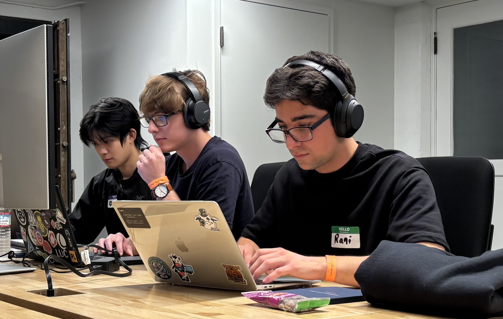
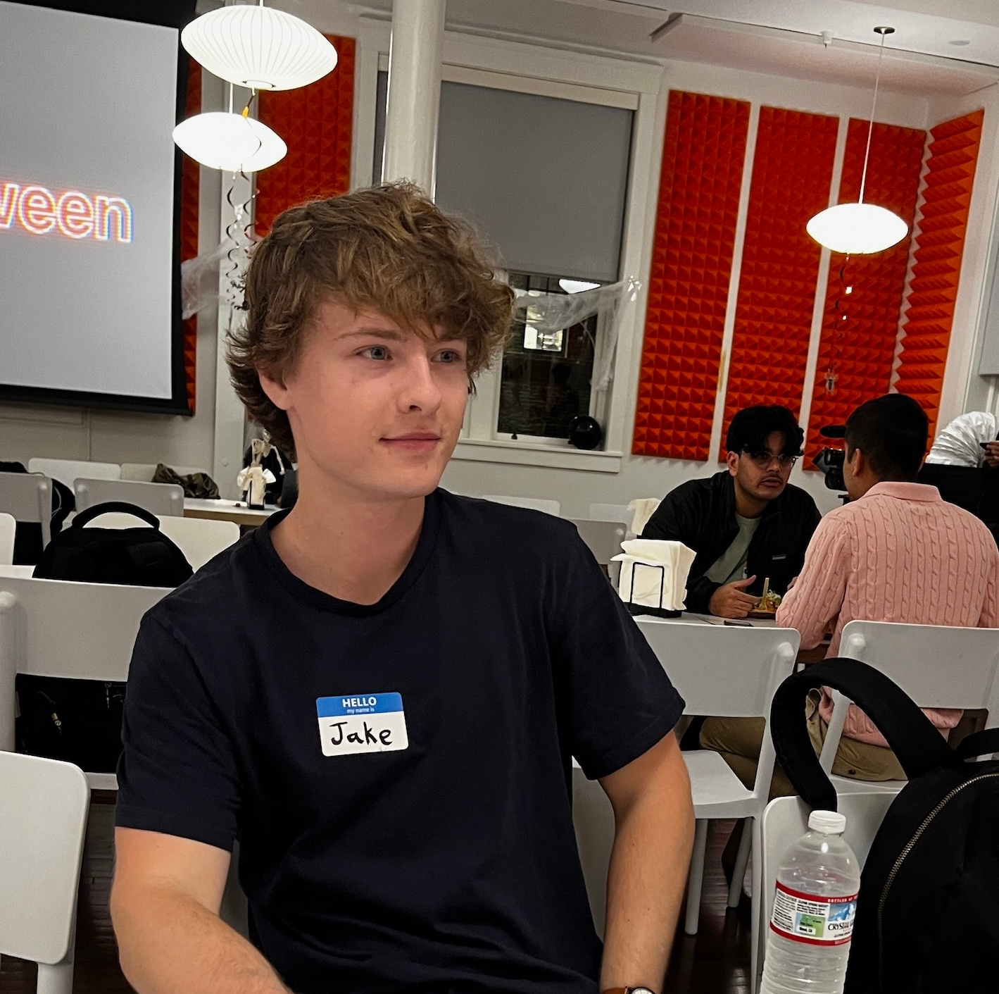

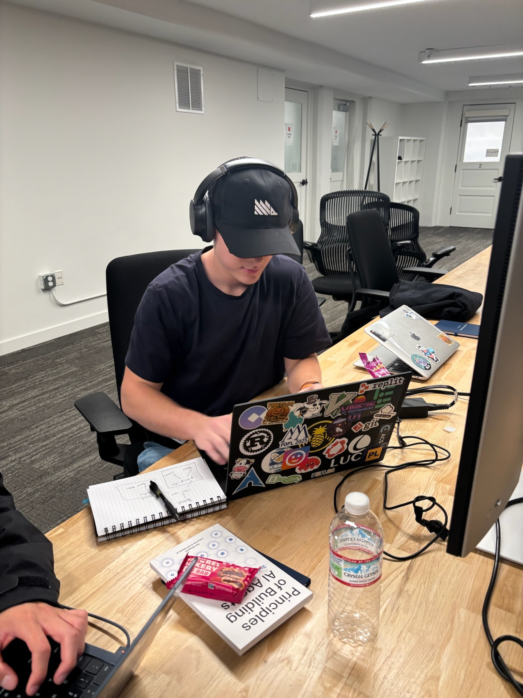
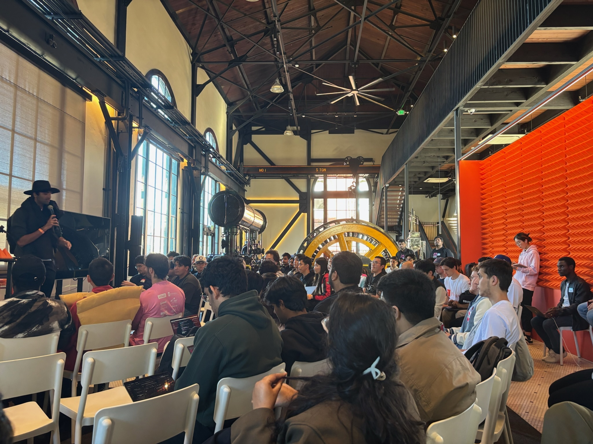


Agentically scan for bugs in FastAPI backend servers.



We won 3rd place for "Best Use of Moss" and got $5K in credits.

## Tranpose Platform’s VibeCode Hackathon - Vibe Code 4



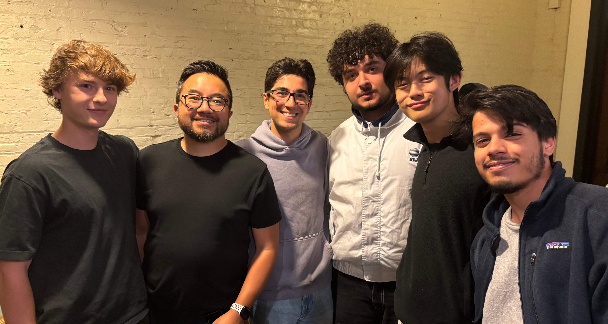



Vibe Gen creates great math explanation videos by creating [Manim](https://github.com/3b1b/manim) code that gets rendered into graphics.



## Hack Davis 2025 - Best Interdisciplinary Hack - Assemblr

We build acustom IDE that lowers the barrier to learning assembly to help you learn by automating an RC car.


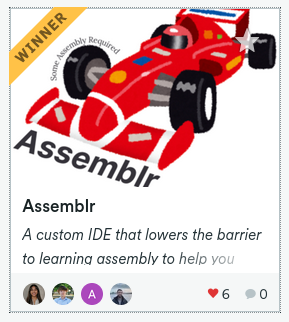
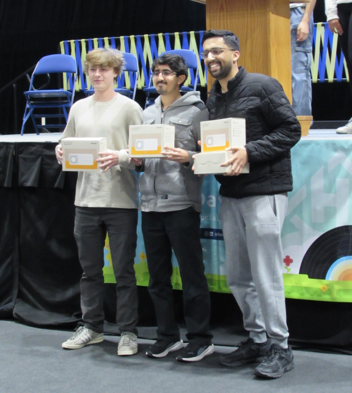
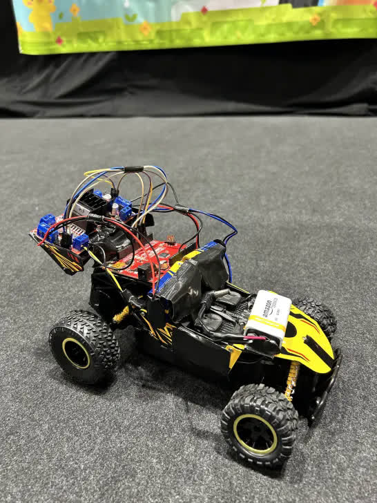


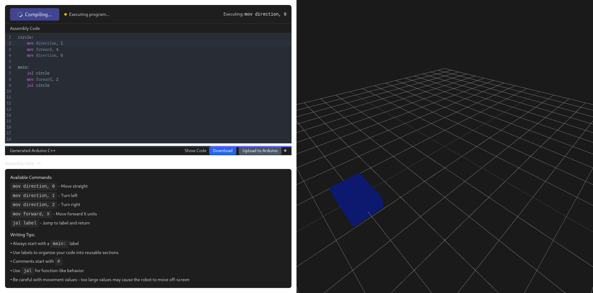

Learning low-level programming languages like assembly is often intimidating and abstract, with a steep learning curve that students typically face later in their college years. But we believe that understanding assembly builds stronger, more powerful coders- and that it shouldn't be reserved for the few who make it that far.

We set out to democratize the learning experience by creating an interactive and engaging way to explore assembly through something tangible: controlling the movement of a RC car.




Devpost



GitHub




 



## Tranpose Platform's VibeCode Hackathon - Onlook Challenge - Chomp

We built a short-form content app for buying take-out food with the goal of reducing user dropoff from analysis paralysis.


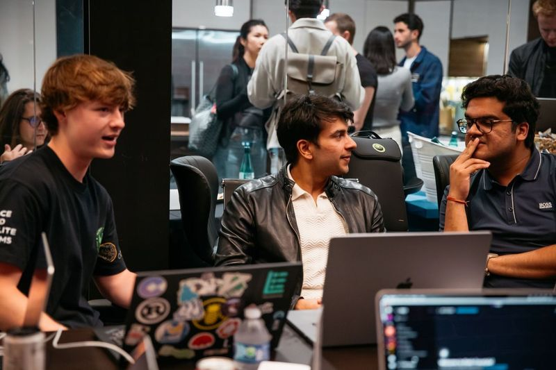
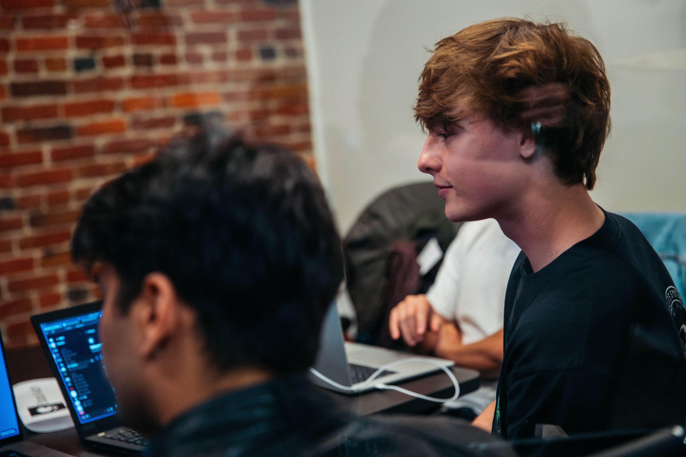
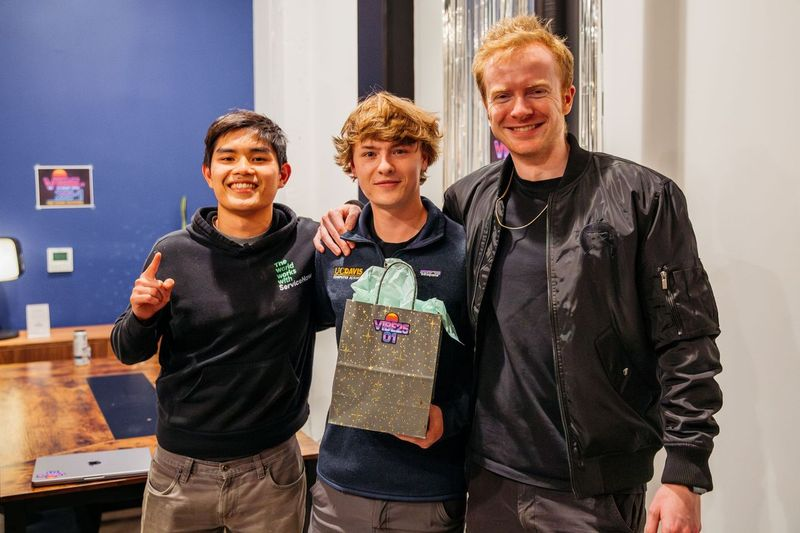
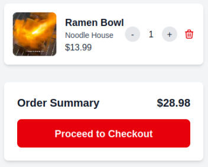



## 1st Place Winner - UC Davis Climate Pitch Competition

 🐮 Calculate the enteric methane emissions from cows based on their food.

We won $1K for first place in the climate pitch.



## Hack Davis 2024 - Safe Drive AI

Mission: Use OpenCV, PyTorch and Intel Developer Cloud to reduce car related injuries and deaths.

  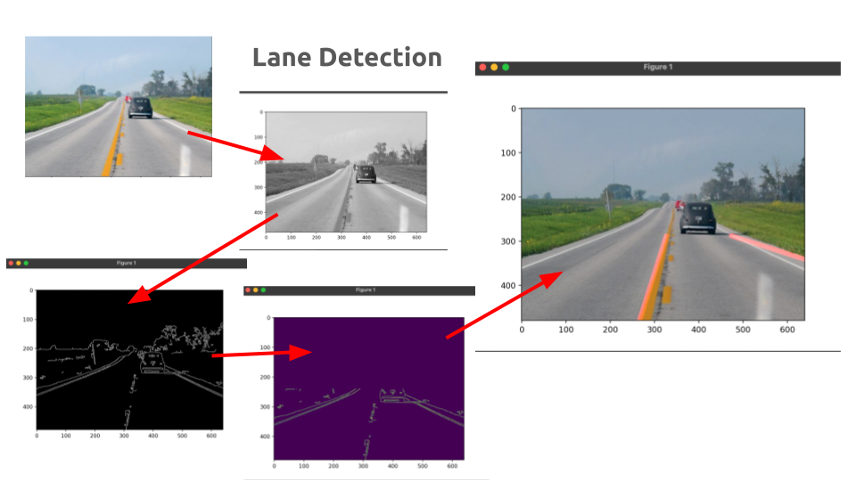



## ProdCon 2025 - 3rd Place Winner - Sid

The core issue we are solving is that the education technology is set up for logistics and not learning, which leaves students to cram for tests, accumulate study dept, and ultimately fall behind.

  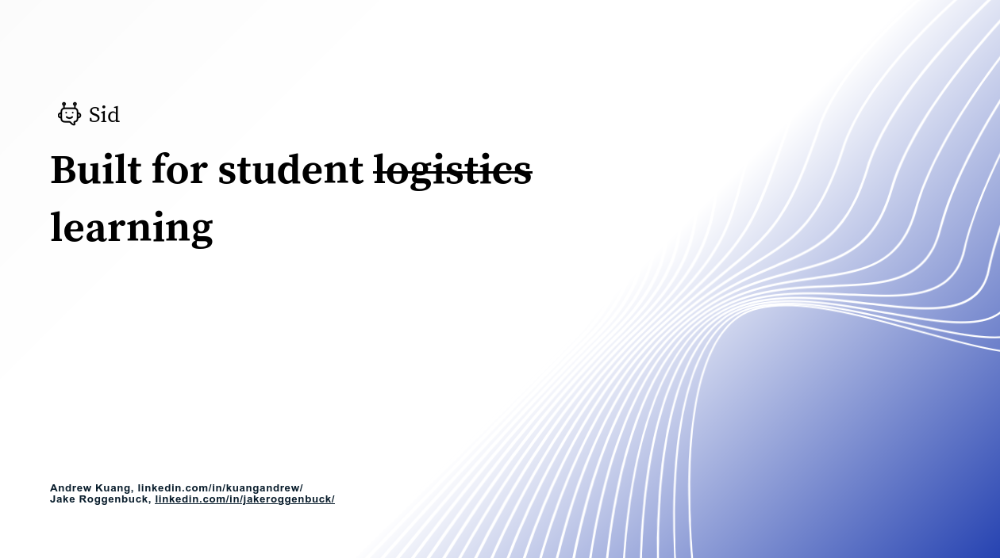

Shouldn't EdTech work for students and professors?

  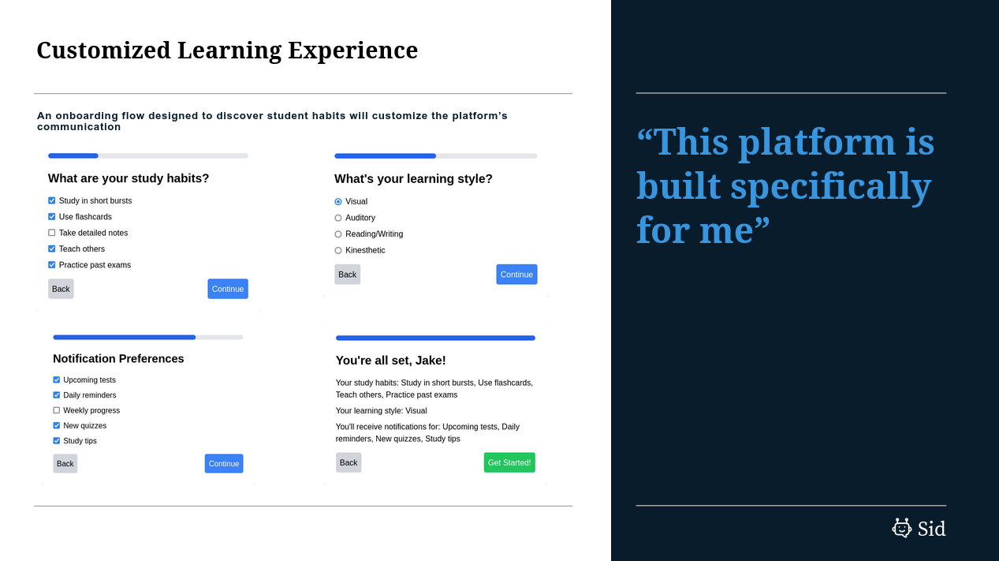


Devpost


## Amazon Sustainability Data Initiative (ASDI) Global Hackathon

Thousands of years ago, humans learned how to farm and formed small agricultural communities that would eventually become the complex networks of farms, food processors, and vendors that feed the world today. But humans then had no technology to assist them besides simple tools and knowledge of common patterns (such as the right weather and soil). Today we have fast internet, machine learning algorithms, and satellite technology that helps us make those decisions! We wanted to employ some of these incredible innovations to build our own service that helps farmers make the most of their land by planting the most suitable crops possible, thus contributing to the UN Sustainable Development Goals of zero hunger and climate action.




Devpost



GitHub




  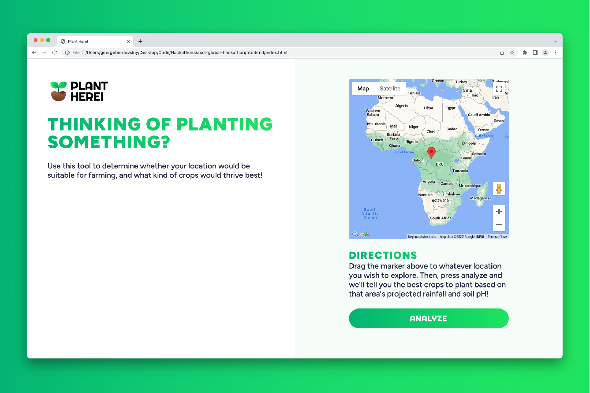

   


