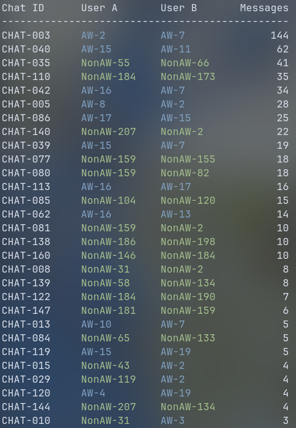
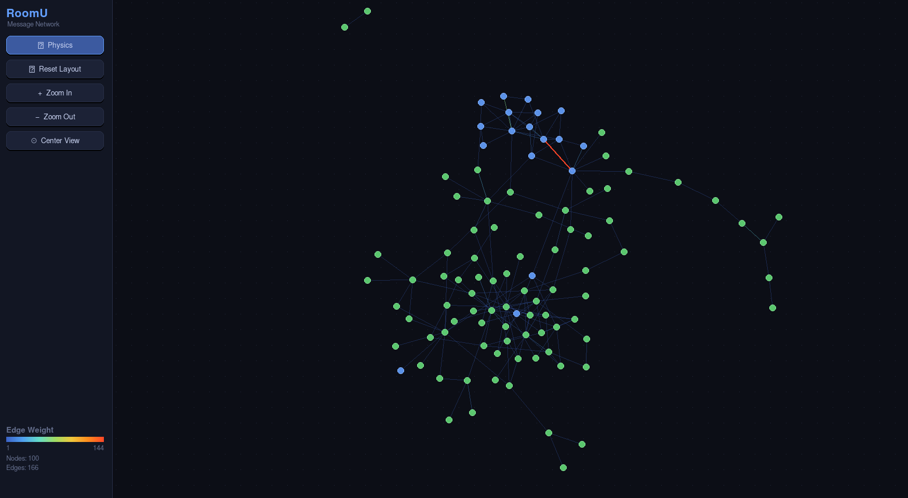

### Building Analytics for RoomU

I joined the RoomU team as a software Engineer a few weeks ago for my last quarter of UC Davis. Inspired by the Jack Dorsey's [remark](https://www.startuparchive.org/p/jack-dorsey-on-twitter-s-biggest-mistake-in-the-early-days) about building analytics tools first at Square, I wanted to focus on that first to better understand the team I just joined. RoomU has been around in this current format since January 2025, making it a year and 3 months old as of writing. So far, nothing past basic setup was done to the PostHog and no other analytics tools exist.

Since RoomU's goal is to connect students via their profile and prompt them to start a chat, I thought the best way to measure activity was to check a) how many users there are, b) how many chats were made, and c) how much people chat after they start. Before this analysis, only the first has ever been measured.

### Message Analytics

I counted message sent by person and labeled them AggieWorks member vs. Non-AggieWorks member. This way we can look at adoption for actual users. Here is the list of all chats with more than 3 total messages sent in the chat.

```sql
SELECT id, chatroom_id FROM roomu_v1.messages
```

Along with a query for users and chat rooms. Which resulted in the data for this chart.



Only 15 chats include two Non-AggieWorks members sending 4 or more total messages. Since it probably takes 10 or more message to establish a connection and decide to live together (or to exchange phone numbers), that might be a better measure for successful chats than just 4 messages. For 10 and above, it's only 9 total chats. That's only 15/276 -> ~5% and 9/276 -> ~3% of total users who have signed up respectively. 

I also made this into a graph view to see how different chats connect with each other. With blue being AggieWorks members and green being Non-AggieWorks users.



We can see the massive cluster of AggieWorks members chatting with each other as well as rather dense graph of Non-AggieWorks members. Also, only two people (in the top left) have edges that don't connect to the rest of the larger group. Everyone else has messaged someone who has messaged someone ... who are all connected to each other.

### What's Next

If the RoomU team wants the product to have impact, we need to a) measure this more regularly and b) make changes to try to optimize for an improved message count by chat and total counts of chats. The only value of RoomU comes from someone meeting in a chat and becoming roommates, so increasing the amount of chats that can produce that outcome is critically important and a prerequisite to any impact.

You can really only fix problems that you can measure and it all starts with these analytics tools that help the team better understand their users. Why do most people not reply to the first message? That's a good interview question for our users. Did they just not see the message? Did they find a roommate elsewhere and delete the app? Why aren't users creating more chats? Do they not find value in the ones they've had? Are they just not finding enough people they'd be interested in being roommates with?

Hopefully this analysis sparks ideation for what new analytics tools to build and what interview questions to ask.
