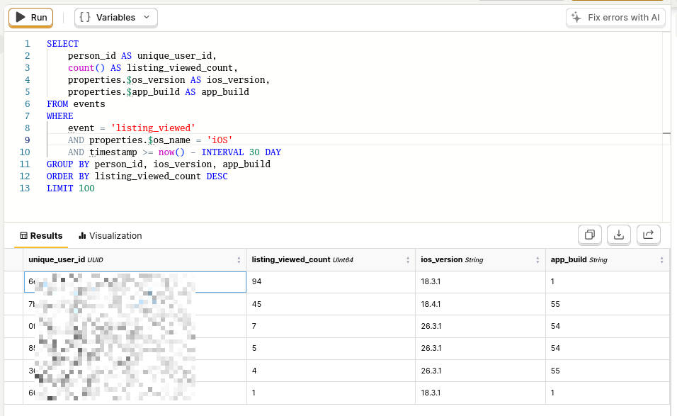
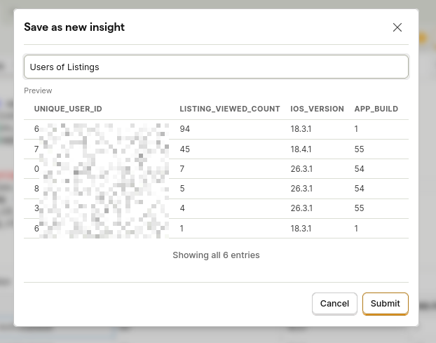
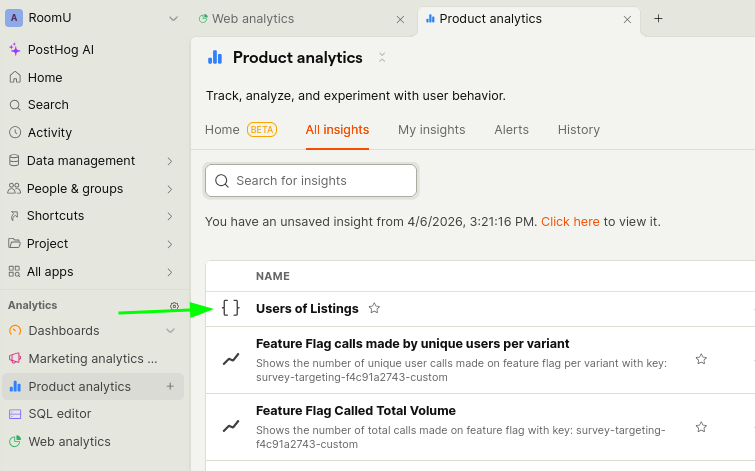

## Motivation

The RoomU team wants to know how people are using the brand new "Listings" feature.

## What we can do

We can (without changing code) see the PostHog capture for "listing_viewed" and then create a table showing who these users are and how many times they have viewed the listing.

Surprisingly, no extra information about a given user is included in these requests and it's not saved anywhere else. The next step I'd recommend is to know who these users are, and allow them to schedule a meeting with a PM to ask them about their experience.

Here is how I crated the SQL in PostHog SQL editor. We can run it and see our data get populated.



Here is the code block that you can copy from.

```sql
SELECT
    person_id AS unique_user_id,
    count() AS listing_viewed_count,
    properties.$os_version AS ios_version,
    properties.$app_build AS app_build
FROM events
WHERE
    event = 'listing_viewed'
    AND properties.$os_name = 'iOS'
    AND timestamp >= now() - INTERVAL 30 DAY
GROUP BY person_id, ios_version, app_build
ORDER BY listing_viewed_count DESC
LIMIT 100
```

We can now save this as an insight:



We can now see it in the Product analytics.



## What we learned

There are currently few people who have used the "Listings" feature. Those who have are likely developers on the team. That being said, we can continue to use this feature after traction starts to see how this might change in the future. We can then request meetings with these users and see how they like the feature.
