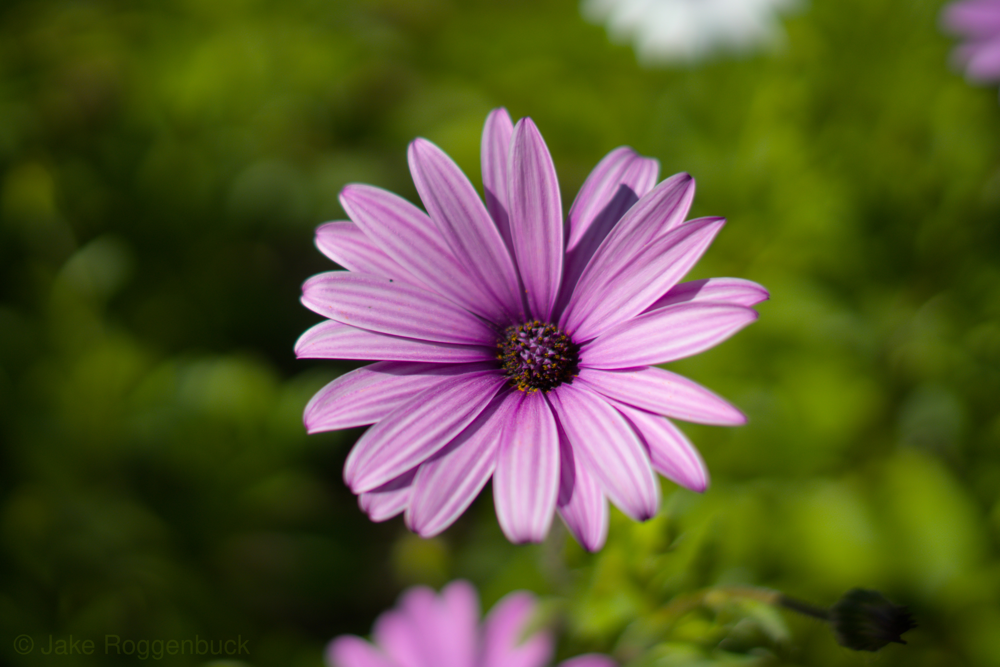
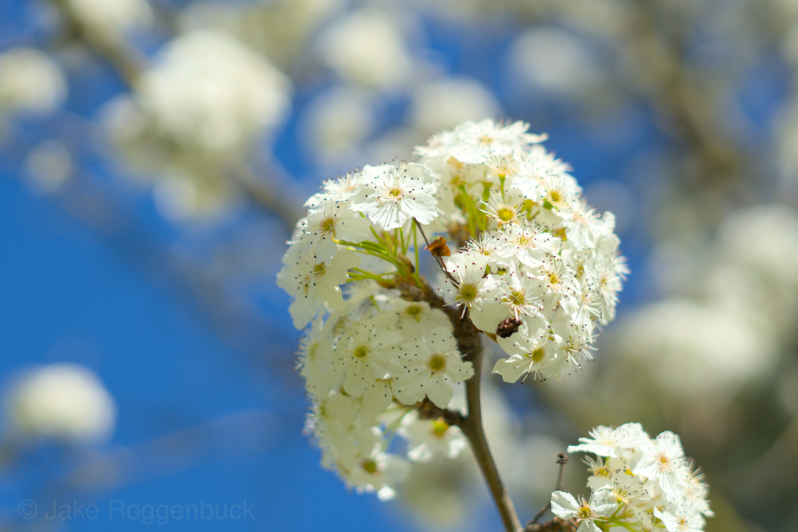
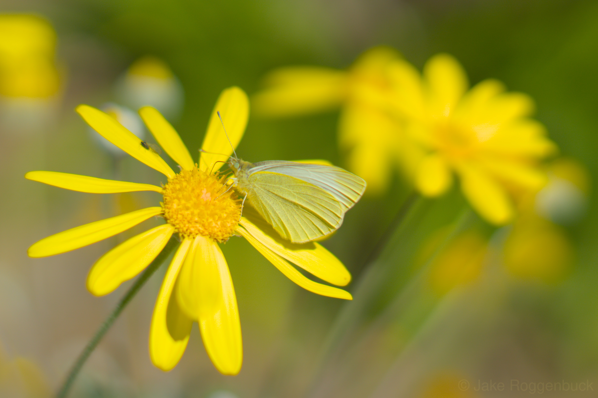

---

I'm currently using a Sony a6400 with a Sony FE 50mm f/1.8, a Sigma 20mm f/1.4, a 16mm-50mm f/3.5-5.5 kit lens, and a lens from an [old Exakta camera](https://jr0.org/posts/exakta-lens-sony-camera/).

I often do nature photography and events.

