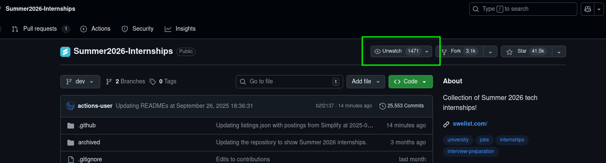
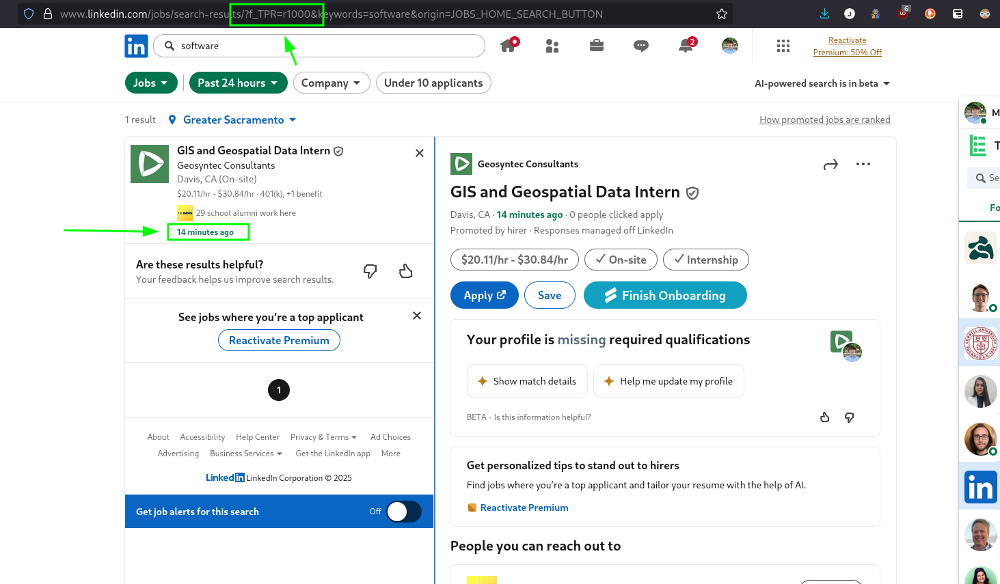


I'm far from the best person to ask about this, but had I found just this information when I was a sophomore or junior, I would have had a head start.


## Why I wrote this

Today in class, someone ask me how the job search was and I replied honestly. It's tedious and frustrating at times, but it's possible and I felt like I am at least partially over the main challenges. Here is the advice I shared with him.

Caveat: This only applies to big tech and medium sized companies -- not startups! Startups are a whole different game that I am still in the process of understanding.

For me, the process felt non-linear. I did a few months of work and saw no results. A few more months of work and I started getting take-homes. I happened to get a take-home from a referral from a friend. Thankfully, I had spent a few months preparing for other take-homes and was ready when it arrived. Some months will feel wasted, but they are just part of the process. You get better and faster at applying and you get better and faster at solving technical problems. The work pays off.

## How I found this out

Before I started recruiting for internships in my junior year, I interviewed a few friends who had already gotten internships and I learned about SWE List, Simplify, and a few other tips. Asking others specific questions about their experience was extremely helpful, and I recommend you do that as well.

## Process

There are generally two steps to landing an internship. The first, is getting noticed for a take-home or an interview. The second is actually passing that take-home or interview. How you prepare for these is drastically different but both require commitment over a long period of time. For me, it was about six months from August to February.

### 1. Getting noticed for an interview or take-home

To get noticed when applying to big tech, it's important to apply to many applications with a good response. You cannot cut corners when mass applying and you cannot focus on JUST quality for a handful of companies. Getting noticed is hard because it requires quantity and quality.

#### Simplify

I'm not sponsored, but overwhelmingly, my friends recommended Simplify and after using it last year to find an internship, I highly recommend it too.

#### SWE list

Made by Simplify, [swelist.com](https://swelist.com) keeps you up to date on job postings. Super helpful to get this by email once a day.

#### "Watch" the SWE List Repo

This isn't widely known yet, but I don't want to gatekeep this. The SWE List info comes from crowd-sourcing and is maintained on GitHub.

Notice how only one out of fourty people have it watched? It's not super widely known yet. And that's out of everyone who 1. knows about it and 2. who starred it. If you click the watch button, you will get emails for EVERY change. You will consantly get emails, but you will also heard about postings much quicker.

#### The LinkedIn Recent Postings

When you use the LinkedIn jobs search, you can sort by last 24 hours as most recent. You can then edit the URL to make that time frame shorter. Here I changed it from "r86400" which is 24 hours in seconds, to "r1000" seconds, which is 16 minutes.

You can then see the only posting, which was posted 14 minutes ago. If you lock-in and do this right in the morning, you might be literally the first person or one of first few to apply for a job, which anecdotally helps a ton.

#### Referrals

Referrals are clutch. It took me some time to come to terms with this real fact. Even though it can only get you a part of the way past part of the process, that's still worthwhile. Ask around your network if you know anyone who knows anyone.

#### Play the long game

Reach out to people now who might be a good contact in a few years -- play the long game sometimes. And if nothing comes of a contact, that's okay too. It's nice just to say hello to someone who works at a company you are interested in. Just be mindful of their time and genuine in your interest to know what their work is like.

### 2. Passing the interview

#### Leetcode

Leetcode is absolutely crucial in getting passed an online-assessment / take-home or technical interview. Practice a bunch of leetcode problems often.

**Optimal Learning Method**

**Why this method?**

At one extreme, is the idea of never using any help to solve leetcode problems. At first this seems to make sense. Struggle through solving a problem, and you're sure to get the best learning outcome. This is what I thought at first too. The fault in this method is that if you get stuck, you may not (in a reasonable amount of time) figure out the solution -- or the general pattern for this type of problem; patterns being the real learning objective. Thus, hurting your learning ability.

On the other extreme, is looking for an answer either at the start or when you first get stuck. This for sure prevents you from learning general patterns. Skipping the struggle of arriving at the solution independently will surely hurt your learning.

The optimal method for learning is in between these too; however more similar to the first method.

If you don't look up any help, you're unlikely to find out these types of solutions. For instance, if you come across a problem that should be solved with a two pointer approach, but you've never done that before, don't stare at the solution until you reinvent the two pointer method.

**The method**

First, you should struggle with the problem. There is no right amount of time, but I have found for myself that about 10-20 minutes for easy problem and 20-30 minutes for medium or hard problems is about right before I should reach for some help.

If I cannot think of a compelling solution within this time, I look at the hints at the bottom of the leetcode description. If this sparks an idea, I go from there and can sometimes solve it, if not, I spend a few minutes thinking about different approaches or solving a subset of cases first (simplify the problem or reduce scope).

Next, if the hint did not help, you should watch the neetcode solution video before he gets to the code explanation. Most neetcode videos will walk through the solution while drawing out diagrams. Watch just this part, and at the end of the explanation, pause the video and try to implement it! If you try and cannot get it to work, walk through the code solution too and try it out. Make sure to take notes and what type of problem is being solved and what general approach is used. Are you using a prefix array? Maybe this is a dynamic programming problem. Take good notes so that you can generalize the problem and actually remember it.

After some time, maybe a day or two, try the problem again and see if you remember the solution. This recall (named [spaced repetition](https://en.wikipedia.org/wiki/Spaced_repetition)) will help solidify your understanding of both this problem, and the problem ype in general in your memory. The physical changes in your brain that happen during this process include a strengthening of the [Myelin](https://en.wikipedia.org/wiki/Myelin) sheath that wraps the axons in your brain, improving your recall. Simply typing out the solution once, does not do enough work to build up this Myelin sheath.

Finally, it's hard to keep up a routine of leetcode. You need to keep the end-game in mind when you work on leetcode. It won't payoff immediately but you need to keep consistent.

#### Neetcode

Neetcode makes great videos on his YouTube channel and has a good website for knowing which problems to work on. I mainly use this website to figure out what problems to work on. At one point, I got good enough at easy problems where I could do a handful in an hour. Doing a bunch of problems just to do problems isn't the point. It's not completely wrong because now I am familiar with a few hundred easy problems, but it was probably overkill to do thay many. Especially if they are easy and very similar types of problems.

#### Mock Interview

Mock interview with friends who've done interviews before. Just having someone to ask the question is really good practice. They might not give good feedback necessarily, but they will be a forcing function for you to learn how to describe yourself well. Some friends actually do know what makes a good interview, but those are usually friends who hire as a part of their job or who have an obligation to recruit for a club. Be careful with feedback but it's super helpful practice regardless.

#### Don't do just leetcode

Make sure to do other types of problems than leetcode too, like Hacker Rank because it’s slightly different. I showed up to my first take-home with only leetcode experience but the take-home was with Hacker Rank. I was somewhat unfamiliar with the style of questions and the tricks I would have internalized had I used it more. It felt like being over-fit to leetcode problems and I had a hard time generalizing. That being said, I still did fine since it was just a coding problem.

At the end of the day, all of these are just programming problems and having a good root understanding is more important. However, it's always a bonus when you have all of the key bindings as muscle memory and know all of the nuanced details of the platform and the type of questions.
