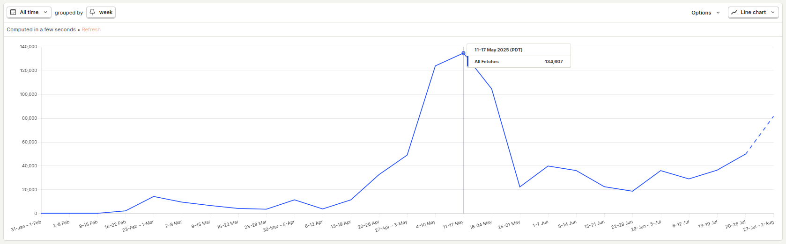
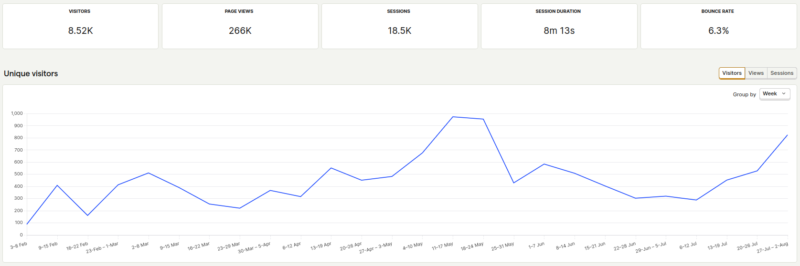

<!--

Outline:

3. In scope vs not

- Prefetch, etc is out of scope
- This focuses on the fastest data transition of large data

4. Picking three routes

- Start with full course data and show each step
- Single course
- Single grade

5. Conclusion

-->


**Early Access:** This post is a work in progress! If you have feedback, please send me feedback at [me@jr0.org](mailto:me@jr0.org)



How I rewrote a Python API with over 100,000 weekly endpoint requests (during peak usage) resulting in over an 8x speed improvement.


Here is a snapshot into what the results are. Left being the old version, middle is an intermediate step, and the right side is on of the fastest versions.


type: 'bar',
data: {
labels: ['Render', 'File Load', 'GZIP own 9'],
datasets: [{
label: 'Mean Execution Time (seconds)',
data: [6.369174861059873, 1.4560875743400903, 0.7445368937799867],
backgroundColor: [
'rgba(255, 99, 132, 0.8)',
'rgba(54, 162, 235, 0.8)',
'rgba(75, 192, 192, 0.8)'
],
borderColor: [
'rgba(255, 99, 132, 1)',
'rgba(54, 162, 235, 1)',
'rgba(75, 192, 192, 1)'
],
borderWidth: 2
}]
},
options: {
responsive: true,
plugins: {
title: {
display: true,
text: 'Performance Metrics: Mean Execution Time',
color: '#e0e0e0'
},
legend: {
onClick: null,
labels: {
color: '#e0e0e0',
boxWidth: 0,
}
},
tooltip: {
backgroundColor: 'rgba(40, 40, 40, 0.9)',
titleColor: '#ffffff',
bodyColor: '#ffffff',
borderColor: '#666666',
borderWidth: 1,
callbacks: {
afterLabel: function(context) {
const errorBars = [0.2591171410731346, 0.6346429647144839, 0.11279561023598754];
const stdDev = errorBars[context.dataIndex];
return `Std Dev: ±${stdDev.toFixed(3)} seconds`;
}
}
}
},
scales: {
y: {
beginAtZero: true,
title: {
display: true,
text: 'Time (seconds)',
color: '#e0e0e0'
},
ticks: {
color: '#b0b0b0'
},
grid: {
color: '#404040'
},
border: {
color: '#666666'
}
},
x: {
title: {
display: true,
text: 'Routes',
color: '#e0e0e0'
},
ticks: {
color: '#b0b0b0'
},
grid: {
color: '#404040'
},
border: {
color: '#666666'
}
}
}
},
plugins: [{
afterDatasetsDraw: function(chart) {
const ctx = chart.ctx;
const meta = chart.getDatasetMeta(0);
const errorBars = [0.2591171410731346, 0.6346429647144839, 0.11279561023598754];
const meanValues = [6.369174861059873, 1.4560875743400903, 0.7445368937799867];
    meta.data.forEach((bar, index) => {
      const stdDev = errorBars[index];
      const mean = meanValues[index];
      const x = bar.x;
      const yScale = chart.scales.y;
      const yTop = yScale.getPixelForValue(mean + stdDev);
      const yBottom = yScale.getPixelForValue(mean - stdDev);
      ctx.save();
      ctx.strokeStyle = '#cccccc';
      ctx.lineWidth = 2;
      // Vertical line
      ctx.beginPath();
      ctx.moveTo(x, yTop);
      ctx.lineTo(x, yBottom);
      ctx.stroke();
      // Top cap
      ctx.beginPath();
      ctx.moveTo(x - 8, yTop);
      ctx.lineTo(x + 8, yTop);
      ctx.stroke();
      // Bottom cap
      ctx.beginPath();
      ctx.moveTo(x - 8, yBottom);
      ctx.lineTo(x + 8, yBottom);
      ctx.stroke();
      ctx.restore();
    });
}
}]


## Background & Problem

In late October of 2024, my team and I started building a course recommendation system that shows grade distributions for UC Davis. Our initial rough version was launched 4 days later on November 2nd. A school year after that, it's been used by 8,200 students, has over 257,000 page views, and our backend has handled over 850,000 requests.

Our first versions of the product (weeks 1-2) were objectively slow, taking upwards of 10 seconds to send and load 4MB of data on the frontend. As soon as we built it, we decided to optimize it because our initial users said they liked the content but it took too long to load on their phone, especially when they were in the library. Those optimizations involved pagination, prefetching data before it was needed, and upgrading our hosting above the free tier of Render. Having the higher tier meant we also didn't have a cold start problem if the product wasn't used every hour. That being said, we still had only 0.5 CPUs and a 512MB of memory.

Many optimizations were done that patched the problem, but none addressed the underlying issue, which was an unoptimized backend written in Python and running on a server that was not powerful enough. Often the backend would run out of memory and would force a restart. These initial patch optimizations were enough to keep our users happy, who said they didn't notice the issue and liked how it had all of the grade data they wanted.

That was until recently. Our traffic has increased substantially and we added a vector search. The addition of the search has meant that both our memory and CPU are not enough to handle the traffic. This leads us to the most recent optimizations to reduce the amount of memory needed, as well as increase the speed of the endpoints.

We initially wrote our backend in Python and FastAPI to quickly validate our product with our target market. We actually didn't realize that students wanted grade data to begin with. We only discovered this after speaking with our users who were already enjoying the early version of our class search. Repositioning our product to focus on grade data was a huge success and we have gained significant traction since then. Both the traction and the addition of computationally complex features like vector search, meant that we have outgrown our original solution.

## The Optimizations

### Optimization 1. Moving to Rust

The route that served data for all courses on the old backend was called `all_courses`. The initial time of the route to send the 4MB of data was `6.369` seconds. This was calculated as an average of 50 total runs (see [methods section](#methods)).

<!-- TODO: Host Rust backend on Render and get time it takes to run -->

The first optimization was to rewrite the `all_courses` route in Rust and host it on a VPS. I went with a Linode server with the following specs:

```
OS: Debian GNU/Linux 11 (bullseye) x86_64
Host: Compute Instance
Kernel: 5.10.0-30-amd64
Uptime: 353 days, 3 hours, 53 mins
Packages: 826 (dpkg)
Shell: bash 5.1.4
Resolution: 1280x800
CPU: AMD EPYC 7642 (1) @ 2.300GHz
GPU: 00:01.0 Vendor 1234 Device 1111
Memory: 271MiB / 1971MiB
```

The new route loads a JSON file called `./all_courses.json`, parses it, and returns the serialized data.

```rust
extern crate rocket;
use rocket::routes;

#[get("/courses")]
pub async fn get_all_courses_json_load() -> Json<Value> {
    let json_string: String = fs::read_to_string("./all_courses.json")
        .await
        .expect("Should have read json file.");

    match from_str::<Value>(&json_string) {
        Ok(json) => Json(json),
        Err(_) => Json(serde_json::json!(
            {"error": "Invalid JSON in GLOBAL_STRING"}
        )),
    }
}
```

The main function sets up the port, the address, and the routes. I used [Rocket.rs](https://rocket.rs/) as the backend framework.

```rust
#[rocket::main]
async fn main() -> Result<(), rocket::Error> {
    let figment = rocket::Config::figment()
        .merge(("port", 8001))
        .merge(("address", "0.0.0.0"));

    let _ = rocket::custom(figment)
        .mount(
            "/courses/",
            routes![get_all_courses_json_load,],
        )
    Ok(())
}
```

<!-- Two separate things were done to improve the time initially. 1. Move from Render to a Linode VPS. 2. Rewrite the route in Rust. If I wanted to isolate every variable, I would either host the Rust backend on Render or host the old Python backend on a VPS. This is a part of the experiment that can be done in the future, but right now, I am lumping these two changes together. TODO: Seperate out these changes -->

Note: All Rust code was run in release mode with `--release` \[[1](#notes)\].

After hosting on the Linode VPS, the route served the same data in `1.456` seconds. That's an `4.374x` increase in speed.


type: 'bar',
data: {
labels: ['Render', 'File Load'],
datasets: [{
label: 'Mean Execution Time (seconds)',
data: [6.369174861059873, 1.4560875743400903],
backgroundColor: [
'rgba(255, 99, 132, 0.8)',
'rgba(54, 162, 235, 0.8)',
],
borderColor: [
'rgba(255, 99, 132, 1)',
'rgba(54, 162, 235, 1)',
],
borderWidth: 2
}]
},
options: {
responsive: true,
plugins: {
title: {
display: true,
text: 'Performance Metrics: Mean Execution Time',
color: '#e0e0e0'
},
legend: {
onClick: null,
labels: {
color: '#e0e0e0',
boxWidth: 0,
}
},
tooltip: {
backgroundColor: 'rgba(40, 40, 40, 0.9)',
titleColor: '#ffffff',
bodyColor: '#ffffff',
borderColor: '#666666',
borderWidth: 1,
callbacks: {
afterLabel: function(context) {
const errorBars = [0.2591171410731346, 0.6346429647144839];
const stdDev = errorBars[context.dataIndex];
return `Std Dev: ±${stdDev.toFixed(3)} seconds`;
}
}
}
},
scales: {
y: {
beginAtZero: true,
title: {
display: true,
text: 'Time (seconds)',
color: '#e0e0e0'
},
ticks: {
color: '#b0b0b0'
},
grid: {
color: '#404040'
},
border: {
color: '#666666'
}
},
x: {
title: {
display: true,
text: 'Routes',
color: '#e0e0e0'
},
ticks: {
color: '#b0b0b0'
},
grid: {
color: '#404040'
},
border: {
color: '#666666'
}
}
}
},
plugins: [{
afterDatasetsDraw: function(chart) {
const ctx = chart.ctx;
const meta = chart.getDatasetMeta(0);
const errorBars = [0.2591171410731346, 0.6346429647144839];
const meanValues = [6.369174861059873, 1.4560875743400903];
    meta.data.forEach((bar, index) => {
      const stdDev = errorBars[index];
      const mean = meanValues[index];
      const x = bar.x;
      const yScale = chart.scales.y;
      const yTop = yScale.getPixelForValue(mean + stdDev);
      const yBottom = yScale.getPixelForValue(mean - stdDev);
      ctx.save();
      ctx.strokeStyle = '#cccccc';
      ctx.lineWidth = 2;
      // Vertical line
      ctx.beginPath();
      ctx.moveTo(x, yTop);
      ctx.lineTo(x, yBottom);
      ctx.stroke();
      // Top cap
      ctx.beginPath();
      ctx.moveTo(x - 8, yTop);
      ctx.lineTo(x + 8, yTop);
      ctx.stroke();
      // Bottom cap
      ctx.beginPath();
      ctx.moveTo(x - 8, yBottom);
      ctx.lineTo(x + 8, yBottom);
      ctx.stroke();
      ctx.restore();
    });
}
}]


Rust is obviously very fast, but actual execution speed of the code isn't the only limiting factor. We also need to be mindful of how and when we load this data from disk into memory.

### Optimization 2. Loading JSON to memory at startup

This startup function loads the JSON data into a global string once at the start of the execution of the server.

```rs
use once_cell::sync::OnceCell;

static GLOBAL_STRING: OnceCell<String> = OnceCell::new();

// Load the JSON to a global string
pub async fn startup_all_courses_string() {
    let json_string: String = fs::read_to_string("./all_courses.json")
        .await
        .expect("Should have read json file.");

    GLOBAL_STRING.set(json_string).unwrap();
}
```

This is the new route that uses that global string and returns the JSON data.

```rs
#[get("/courses-json")]
pub async fn get_all_courses_json() -> Json<Value> {
    if let Some(s) = GLOBAL_STRING.get() {
        match from_str::<Value>(s) {
            Ok(json) => Json(json),
            Err(_) => Json(serde_json::json!(
                {"error": "Invalid JSON in GLOBAL_STRING"}
            )),
        }
    } else {
        Json(serde_json::json!({"message": "Not initialized yet..."}))
    }
}
```

Then we call the function in main at startup.

```rs
#[rocket::main]
async fn main() -> Result<(), rocket::Error> {
    startup_all_courses_string().await;

    // -- snip --
}
```

Loading the JSON to memory once at the start of the server, saves us from doing it each time the route is called.

The resulting speed was `1.425` with a `4.469x` speed increase.

Now with loading our file on startup, we can think about how we send the data back to the caller.

### Optimization 3. Using RawJson

We just return the JSON as `RawJson`, so no serialization has to be done [[1](https://api.rocket.rs/master/rocket/response/content/struct.RawJson)].

```rust
#[get("/courses")]
async fn get_all_courses() -> RawJson<String> {
    if let Some(s) = GLOBAL_STRING.get() {
        RawJson(s.to_string())
    } else {
        RawJson(r#"{"message": "Not initialized yet..."}"#.to_string())
    }
}
```

Now the route runs in `1.550` seconds. An `4.109x` improvement from the original but not an improvement from the previous route.


type: 'bar',
data: {
labels: ['JSON Memory', 'Raw JSON'],
datasets: [{
label: 'Mean Execution Time (seconds)',
data: [1.4252088000000003, 1.5500796356199862],
backgroundColor: [
'rgba(255, 99, 132, 0.8)',
'rgba(54, 162, 235, 0.8)'
],
borderColor: [
'rgba(255, 99, 132, 1)',
'rgba(54, 162, 235, 1)'
],
borderWidth: 2
}]
},
options: {
responsive: true,
plugins: {
title: {
display: true,
text: 'JSON Processing Performance Comparison',
color: '#e0e0e0'
},
legend: {
onClick: null,
labels: {
color: '#e0e0e0',
boxWidth: 0,
}
},
tooltip: {
backgroundColor: 'rgba(40, 40, 40, 0.9)',
titleColor: '#ffffff',
bodyColor: '#ffffff',
borderColor: '#666666',
borderWidth: 1,
callbacks: {
afterLabel: function(context) {
const errorBars = [0.08349626759118409, 0.10216213479459138];
const stdError = errorBars[context.dataIndex];
return `Std Error: ±${stdError.toFixed(3)} seconds`;
}
}
}
},
scales: {
y: {
beginAtZero: true,
title: {
display: true,
text: 'Time (seconds)',
color: '#e0e0e0'
},
ticks: {
color: '#b0b0b0'
},
grid: {
color: '#404040'
},
border: {
color: '#666666'
}
},
x: {
title: {
display: true,
text: 'JSON Processing Methods',
color: '#e0e0e0'
},
ticks: {
color: '#b0b0b0'
},
grid: {
color: '#404040'
},
border: {
color: '#666666'
}
}
}
},
plugins: [{
afterDatasetsDraw: function(chart) {
const ctx = chart.ctx;
const meta = chart.getDatasetMeta(0);
const errorBars = [0.08349626759118409, 0.10216213479459138];
const meanValues = [1.4252088000000003, 1.5500796356199862];
    meta.data.forEach((bar, index) => {
      const stdError = errorBars[index];
      const mean = meanValues[index];
      const x = bar.x;
      const yScale = chart.scales.y;
      const yTop = yScale.getPixelForValue(mean + stdError);
      const yBottom = yScale.getPixelForValue(mean - stdError);
      ctx.save();
      ctx.strokeStyle = '#cccccc';
      ctx.lineWidth = 2;
      // Vertical line
      ctx.beginPath();
      ctx.moveTo(x, yTop);
      ctx.lineTo(x, yBottom);
      ctx.stroke();
      // Top cap
      ctx.beginPath();
      ctx.moveTo(x - 8, yTop);
      ctx.lineTo(x + 8, yTop);
      ctx.stroke();
      // Bottom cap
      ctx.beginPath();
      ctx.moveTo(x - 8, yBottom);
      ctx.lineTo(x + 8, yBottom);
      ctx.stroke();
      ctx.restore();
    });
}
}]


As you can see, the mean execution time of the routes are very similar. Moreover, their error bars tell us that these two are practically the same.

We can do a Two Sample T-Test for significance using Python:

```Python
from scipy.stats import ttest_ind

json_memory = [ ] # ... data given in appendix
raw_json = [ ] # ... data given in appendix

t_stat, p_value = ttest_ind(json_memory, raw_json, equal_var=False)

print(t_stat, p_value)
```

```Python
-0.9368941557046255 0.35120718054235234
```

Since out p-value, is `0.351`, and greater than `0.05`, we can tell that these two execution times are not significantly different. It didn't significantly speed up or slow down execution time by using RawJSON instead of the normal JSON.

We've figured out how to optimize by loading data into memory at startup, but we still need to be mindful of how much data we are sending, because right now, it's still 4MBs of data.

### Optimization 4. Gzip Data

<!-- The next optimization is to use gzip to compress the file before it gets sent. Because it's sending less data, we can expect some amount of time improvement. Furthermore, we can compress the data at startup and save it as a file and just load from a file and return it. I also optimized for the compression ratio compared to speed of compression.

At a high level, when the route gets hit, we are loading the gzipped version of our data into memory as a `Vec<u8>`, which is how you can represent bytes in Rust. We then use our Responder to return the bytes as well as setting the Header `Content-Encoding` to `gzip` so the service that fetches this data knows that it needs to be decompressed before it can be used. It's important to test the time it takes to decompress the data as well as the time it takes to send the data, as both impact real-world performance. -->

The next optimization is to use gzip to compress the file before it gets sent. Because it's sending less data, we can expect some amount of time improvement. When the route gets called, it loads a premade gzip file called `./all_courses.json.1.gz` and returns the data.

This is a Responder that tells the rocket framework that we mean to send binary data with the gzip Content-Encoding. When the endpoint gets called, the caller knows that this data is zipped, and that it should decompress it as it receives the data.

```rs
struct GzippedJson(Vec<u8>);

#[rocket::async_trait]
impl<'r> Responder<'r, 'static> for GzippedJson {
    fn respond_to(self, _: &'r Request<'_>) -> rocket::response::Result<'static> {
        Response::build()
            .header(ContentType::JSON)
            .header(Header::new("Content-Encoding", "gzip"))
            .sized_body(self.0.len(), Cursor::new(self.0))
            .ok()
    }
}
```

Gzip has 9 levels of compression. Level 1 is the fastest to compress but also the worst compression. Level 9 is the best compression but the slowest. I made a route for each level to compare them to each other. This is the gzip level 1 route. There are also 8 other routes for each of the gzip levels (2-9).

```rs
#[get("/courses-gzip-1-inline")]
pub async fn get_all_courses_gzip_one_inline() -> Result<GzippedJson, Status> {
    let name = "./all_courses.json.1.gz";
    let mut gzip_file = match File::open(name).await {
        Ok(file) => file,
        Err(_) => return Err(Status::InternalServerError),
    };

    let mut gzip_contents = Vec::new();
    match gzip_file.read_to_end(&mut gzip_contents).await {
        Ok(_) => Ok(GzippedJson(gzip_contents)),
        Err(_) => Err(Status::InternalServerError),
    }
}
```

The best one was Gzip level 8, which took `0.781` seconds to run. This resulted in a `8.154x` speedup from the original. Other than the Gzip level 1, the execution times are basically the same. It's safe to say that the execution times with different levels of Gzip aren't significantly different, especially given the error bars that are larger than the difference in the execution times.


type: 'bar',
data: {
labels: ['Gzip Inline Clone 1', 'Gzip Inline Clone 9', 'Gzip Inline Clone 7', 'Gzip Inline Clone 4', 'Gzip Inline Clone 5', 'Gzip Inline Clone 3', 'Gzip Inline Clone 2', 'Gzip Inline Clone 6', 'Gzip Inline Clone 8'],
datasets: [{
label: 'Mean Execution Time (seconds)',
data: [0.8368181653398278, 0.7810885166600565, 0.7824843093800155, 0.7765849953799989, 0.7773541713599843, 0.7633252797201203, 0.7555291458401189, 0.7452488209999137, 0.7432830796599592],
backgroundColor: [
'rgba(255, 99, 132, 0.8)',
'rgba(255, 159, 64, 0.8)',
'rgba(255, 205, 86, 0.8)',
'rgba(75, 192, 192, 0.8)',
'rgba(54, 162, 235, 0.8)',
'rgba(153, 102, 255, 0.8)',
'rgba(201, 203, 207, 0.8)',
'rgba(255, 99, 255, 0.8)',
'rgba(99, 255, 132, 0.8)'
],
borderColor: [
'rgba(255, 99, 132, 1)',
'rgba(255, 159, 64, 1)',
'rgba(255, 205, 86, 1)',
'rgba(75, 192, 192, 1)',
'rgba(54, 162, 235, 1)',
'rgba(153, 102, 255, 1)',
'rgba(201, 203, 207, 1)',
'rgba(255, 99, 255, 1)',
'rgba(99, 255, 132, 1)'
],
borderWidth: 2
}]
},
options: {
responsive: true,
plugins: {
title: {
display: true,
text: 'Gzip Inline Clone Performance Comparison',
color: '#e0e0e0'
},
legend: {
onClick: null,
labels: {
color: '#e0e0e0',
boxWidth: 0,
}
},
tooltip: {
backgroundColor: 'rgba(40, 40, 40, 0.9)',
titleColor: '#ffffff',
bodyColor: '#ffffff',
borderColor: '#666666',
borderWidth: 1,
callbacks: {
afterLabel: function(context) {
const errorBars = [0.21327256608237583, 0.14640932449901906, 0.13508388551989717, 0.12879601537363955, 0.1590585490140576, 0.12866482693516748, 0.08742206467629585, 0.098992305811364, 0.09742097404424784];
const stdDev = errorBars[context.dataIndex];
return `Std Dev: ±${stdDev.toFixed(3)} seconds`;
}
}
}
},
scales: {
y: {
beginAtZero: true,
title: {
display: true,
text: 'Time (seconds)',
color: '#e0e0e0'
},
ticks: {
color: '#b0b0b0'
},
grid: {
color: '#404040'
},
border: {
color: '#666666'
}
},
x: {
title: {
display: true,
text: 'Clone Versions',
color: '#e0e0e0'
},
ticks: {
color: '#b0b0b0'
},
grid: {
color: '#404040'
},
border: {
color: '#666666'
}
}
}
},
plugins: [{
afterDatasetsDraw: function(chart) {
const ctx = chart.ctx;
const meta = chart.getDatasetMeta(0);
const errorBars = [0.21327256608237583, 0.14640932449901906, 0.13508388551989717, 0.12879601537363955, 0.1590585490140576, 0.12866482693516748, 0.08742206467629585, 0.098992305811364, 0.09742097404424784];
const meanValues = [0.8368181653398278, 0.7810885166600565, 0.7824843093800155, 0.7765849953799989, 0.7773541713599843, 0.7633252797201203, 0.7555291458401189, 0.7452488209999137, 0.7432830796599592];
    meta.data.forEach((bar, index) => {
      const stdDev = errorBars[index];
      const mean = meanValues[index];
      const x = bar.x;
      const yScale = chart.scales.y;
      const yTop = yScale.getPixelForValue(mean + stdDev);
      const yBottom = yScale.getPixelForValue(mean - stdDev);
      ctx.save();
      ctx.strokeStyle = '#cccccc';
      ctx.lineWidth = 2;
      // Vertical line
      ctx.beginPath();
      ctx.moveTo(x, yTop);
      ctx.lineTo(x, yBottom);
      ctx.stroke();
      // Top cap
      ctx.beginPath();
      ctx.moveTo(x - 8, yTop);
      ctx.lineTo(x + 8, yTop);
      ctx.stroke();
      // Bottom cap
      ctx.beginPath();
      ctx.moveTo(x - 8, yBottom);
      ctx.lineTo(x + 8, yBottom);
      ctx.stroke();
      ctx.restore();
    });
}
}]


The main takeaway is, the level of Gzip here doesn't make a significant difference. That being said, Gzipped data vs. Non-Gzipped data does make a difference, as seen below.


type: 'bar',
data: {
labels: ['Raw JSON', 'Gzip Inline Clone 8'],
datasets: [{
label: 'Mean Execution Time (seconds)',
data: [1.5500796356199862, 0.7432830796599592],
backgroundColor: [
'rgba(255, 99, 132, 0.8)',
'rgba(54, 162, 235, 0.8)'
],
borderColor: [
'rgba(255, 99, 132, 1)',
'rgba(54, 162, 235, 1)'
],
borderWidth: 2
}]
},
options: {
responsive: true,
plugins: {
title: {
display: true,
text: 'Raw JSON vs Gzip Inline Clone 8 Performance',
color: '#e0e0e0'
},
legend: {
onClick: null,
labels: {
color: '#e0e0e0',
boxWidth: 0,
}
},
tooltip: {
backgroundColor: 'rgba(40, 40, 40, 0.9)',
titleColor: '#ffffff',
bodyColor: '#ffffff',
borderColor: '#666666',
borderWidth: 1,
callbacks: {
afterLabel: function(context) {
const errorBars = [0.722395382937497, 0.09742097404424784];
const stdDev = errorBars[context.dataIndex];
return `Std Dev: ±${stdDev.toFixed(3)} seconds`;
}
}
}
},
scales: {
y: {
beginAtZero: true,
title: {
display: true,
text: 'Time (seconds)',
color: '#e0e0e0'
},
ticks: {
color: '#b0b0b0'
},
grid: {
color: '#404040'
},
border: {
color: '#666666'
}
},
x: {
title: {
display: true,
text: 'Processing Methods',
color: '#e0e0e0'
},
ticks: {
color: '#b0b0b0'
},
grid: {
color: '#404040'
},
border: {
color: '#666666'
}
}
}
},
plugins: [{
afterDatasetsDraw: function(chart) {
const ctx = chart.ctx;
const meta = chart.getDatasetMeta(0);
const errorBars = [0.722395382937497, 0.09742097404424784];
const meanValues = [1.5500796356199862, 0.7432830796599592];
    meta.data.forEach((bar, index) => {
      const stdDev = errorBars[index];
      const mean = meanValues[index];
      const x = bar.x;
      const yScale = chart.scales.y;
      const yTop = yScale.getPixelForValue(mean + stdDev);
      const yBottom = yScale.getPixelForValue(mean - stdDev);
      ctx.save();
      ctx.strokeStyle = '#cccccc';
      ctx.lineWidth = 2;
      // Vertical line
      ctx.beginPath();
      ctx.moveTo(x, yTop);
      ctx.lineTo(x, yBottom);
      ctx.stroke();
      // Top cap
      ctx.beginPath();
      ctx.moveTo(x - 8, yTop);
      ctx.lineTo(x + 8, yTop);
      ctx.stroke();
      // Bottom cap
      ctx.beginPath();
      ctx.moveTo(x - 8, yBottom);
      ctx.lineTo(x + 8, yBottom);
      ctx.stroke();
      ctx.restore();
    });
}
}]


### Optimization 5. Preloading Data Into Memory

We can use the technique developed in [Optimization 2.](#optimization-2-loading-json-to-memory-at-startup) to preload data into memory at startup. This time, we are loading the gzip data into memory, instead of JSON data. The reason here is the same; to save time by not needing to load a file when the route gets called.

```rs
static GZIPPED_COURSE_NINE: OnceCell<Vec<u8>> = OnceCell::new();

#[get("/courses-gzip-9-preload")]
async fn get_all_courses_gzip_nine_preload() -> Result<GzippedJson, Status> {
    match GZIPPED_COURSE_NINE.get() {
        Some(contents) => Ok(GzippedJson(contents.clone())),
        None => Err(Status::InternalServerError),
    }
}
```

The startup code loads the file from disk and stores it into the `OnceCell`.

```rust
async fn startup() {
    // -- snip --

    let mut gzip_file = File::open("./all_courses.json.9.gz")
        .await
        .expect("Failed to open gzip-9 file");

    let mut gzip_contents = Vec::new();
    gzip_file
        .read_to_end(&mut gzip_contents)
        .await
        .expect("Failed to read gzip-9 file");

    GZIPPED_COURSE_SIX.set(gzip_contents).unwrap();
}
```

It took `0.778` seconds to run. This results in an `8.186x` speed improvement overall.


type: 'bar',
data: {
labels: ['Gzip Clone 2', 'Gzip Clone 1', 'Gzip Clone 5', 'Gzip Clone 3', 'Gzip Clone 9', 'Gzip Clone 4', 'Gzip Clone 8', 'Gzip Clone 7', 'Gzip Clone 6'],
datasets: [{
label: 'Mean Execution Time (seconds)',
data: [0.8160195315601232, 0.8156704822000029, 0.7998635946800278, 0.7973412051801279, 0.778301530739991, 0.7686760814599984, 0.7653455096598555, 0.7635946762201639, 0.7590478010600782],
backgroundColor: [
'rgba(255, 99, 132, 0.8)',
'rgba(255, 159, 64, 0.8)',
'rgba(255, 205, 86, 0.8)',
'rgba(75, 192, 192, 0.8)',
'rgba(54, 162, 235, 0.8)',
'rgba(153, 102, 255, 0.8)',
'rgba(201, 203, 207, 0.8)',
'rgba(255, 99, 255, 0.8)',
'rgba(99, 255, 132, 0.8)'
],
borderColor: [
'rgba(255, 99, 132, 1)',
'rgba(255, 159, 64, 1)',
'rgba(255, 205, 86, 1)',
'rgba(75, 192, 192, 1)',
'rgba(54, 162, 235, 1)',
'rgba(153, 102, 255, 1)',
'rgba(201, 203, 207, 1)',
'rgba(255, 99, 255, 1)',
'rgba(99, 255, 132, 1)'
],
borderWidth: 2
}]
},
options: {
responsive: true,
plugins: {
title: {
display: true,
text: 'Gzip Clone Performance Comparison',
color: '#e0e0e0'
},
legend: {
onClick: null,
labels: {
color: '#e0e0e0',
boxWidth: 0,
}
},
tooltip: {
backgroundColor: 'rgba(40, 40, 40, 0.9)',
titleColor: '#ffffff',
bodyColor: '#ffffff',
borderColor: '#666666',
borderWidth: 1,
callbacks: {
afterLabel: function(context) {
const errorBars = [0.17127265854588763, 0.1996684951847336, 0.15271013845577763, 0.17403583257200395, 0.14202914245318102, 0.13397251071996905, 0.12246670577815581, 0.17856005247325293, 0.12213095194280894];
const stdDev = errorBars[context.dataIndex];
return `Std Dev: ±${stdDev.toFixed(3)} seconds`;
}
}
}
},
scales: {
y: {
beginAtZero: true,
title: {
display: true,
text: 'Time (seconds)',
color: '#e0e0e0'
},
ticks: {
color: '#b0b0b0'
},
grid: {
color: '#404040'
},
border: {
color: '#666666'
}
},
x: {
title: {
display: true,
text: 'Clone Versions',
color: '#e0e0e0'
},
ticks: {
color: '#b0b0b0'
},
grid: {
color: '#404040'
},
border: {
color: '#666666'
}
}
}
},
plugins: [{
afterDatasetsDraw: function(chart) {
const ctx = chart.ctx;
const meta = chart.getDatasetMeta(0);
const errorBars = [0.17127265854588763, 0.1996684951847336, 0.15271013845577763, 0.17403583257200395, 0.14202914245318102, 0.13397251071996905, 0.12246670577815581, 0.17856005247325293, 0.12213095194280894];
const meanValues = [0.8160195315601232, 0.8156704822000029, 0.7998635946800278, 0.7973412051801279, 0.778301530739991, 0.7686760814599984, 0.7653455096598555, 0.7635946762201639, 0.7590478010600782];
    meta.data.forEach((bar, index) => {
      const stdDev = errorBars[index];
      const mean = meanValues[index];
      const x = bar.x;
      const yScale = chart.scales.y;
      const yTop = yScale.getPixelForValue(mean + stdDev);
      const yBottom = yScale.getPixelForValue(mean - stdDev);
      ctx.save();
      ctx.strokeStyle = '#cccccc';
      ctx.lineWidth = 2;
      // Vertical line
      ctx.beginPath();
      ctx.moveTo(x, yTop);
      ctx.lineTo(x, yBottom);
      ctx.stroke();
      // Top cap
      ctx.beginPath();
      ctx.moveTo(x - 8, yTop);
      ctx.lineTo(x + 8, yTop);
      ctx.stroke();
      // Bottom cap
      ctx.beginPath();
      ctx.moveTo(x - 8, yBottom);
      ctx.lineTo(x + 8, yBottom);
      ctx.stroke();
      ctx.restore();
    });
}
}]


You can also see here that there isn't a significant difference in the execution time by Gzip level.

## Bonus Optimization Attempts

These are attempted optimizations that had no significant effect for this use case, but I still wanted to mention them.

### Attempt 1. Using Owned Data

I tried to improve the speed by not cloning the data, but this didn't have any significant speedup.

```rs
#[get("/courses-gzip-6-preload-own")]
async fn get_all_courses_gzip_six_preload_own() -> Result<GzippedJson, Status> {
    match GZIPPED_COURSE_SIX.get() {
        Some(contents) => Ok(GzippedJson(contents.to_owned())),
        None => Err(Status::InternalServerError),
    }
}
```

This route swaps `contents.clone()` with `contents.to_owned()`, which should cause it to speed up because it does not have to copy memory, but copying memory is so quick, it's lost in the noise of the speed tests and is not significant here.

Not all hypothetical optimizations show scientific results.

Here is a comparison of the best from optimization 3, optimization 4, and this attempt. The values are not significantly different.


type: 'bar',
data: {
labels: ['Gzip Clone 6', 'Gzip Inline Clone 8', 'Gzip Own 9'],
datasets: [{
label: 'Mean Execution Time (seconds)',
data: [0.7590478010600782, 0.7432830796599592, 0.7445368937799867],
backgroundColor: [
'rgba(255, 99, 132, 0.8)',
'rgba(54, 162, 235, 0.8)',
'rgba(255, 206, 86, 0.8)'
],
borderColor: [
'rgba(255, 99, 132, 1)',
'rgba(54, 162, 235, 1)',
'rgba(255, 206, 86, 1)'
],
borderWidth: 2
}]
},
options: {
responsive: true,
plugins: {
title: {
display: true,
text: 'Gzip Performance Comparison: Top 3 Methods',
color: '#e0e0e0'
},
legend: {
onClick: null,
labels: {
color: '#e0e0e0',
boxWidth: 0,
}
},
tooltip: {
backgroundColor: 'rgba(40, 40, 40, 0.9)',
titleColor: '#ffffff',
bodyColor: '#ffffff',
borderColor: '#666666',
borderWidth: 1,
callbacks: {
afterLabel: function(context) {
const errorBars = [0.12213095194280894, 0.09742097404424784, 0.11279561023598754];
const stdDev = errorBars[context.dataIndex];
return `Std Dev: ±${stdDev.toFixed(3)} seconds`;
}
}
}
},
scales: {
y: {
beginAtZero: true,
title: {
display: true,
text: 'Time (seconds)',
color: '#e0e0e0'
},
ticks: {
color: '#b0b0b0'
},
grid: {
color: '#404040'
},
border: {
color: '#666666'
}
},
x: {
title: {
display: true,
text: 'Gzip Methods',
color: '#e0e0e0'
},
ticks: {
color: '#b0b0b0'
},
grid: {
color: '#404040'
},
border: {
color: '#666666'
}
}
}
},
plugins: [{
afterDatasetsDraw: function(chart) {
const ctx = chart.ctx;
const meta = chart.getDatasetMeta(0);
const errorBars = [0.12213095194280894, 0.09742097404424784, 0.11279561023598754];
const meanValues = [0.7590478010600782, 0.7432830796599592, 0.7445368937799867];
    meta.data.forEach((bar, index) => {
      const stdDev = errorBars[index];
      const mean = meanValues[index];
      const x = bar.x;
      const yScale = chart.scales.y;
      const yTop = yScale.getPixelForValue(mean + stdDev);
      const yBottom = yScale.getPixelForValue(mean - stdDev);
      ctx.save();
      ctx.strokeStyle = '#cccccc';
      ctx.lineWidth = 2;
      // Vertical line
      ctx.beginPath();
      ctx.moveTo(x, yTop);
      ctx.lineTo(x, yBottom);
      ctx.stroke();
      // Top cap
      ctx.beginPath();
      ctx.moveTo(x - 8, yTop);
      ctx.lineTo(x + 8, yTop);
      ctx.stroke();
      // Bottom cap
      ctx.beginPath();
      ctx.moveTo(x - 8, yBottom);
      ctx.lineTo(x + 8, yBottom);
      ctx.stroke();
      ctx.restore();
    });
}
}]


### Attempt 2. Compiler Flags

Using compiler flags can optimize Rust and was effective in [RedoxQL](https://github.com/JakeRoggenbuck/RedoxQL?tab=readme-ov-file#using-rust-compilation-flags) but when the performance of an API has a lot of noise due to sending the data over the wire, the optimizations have to be rather large to show significant and consistent results. I couldn't find any speed improvements with better compiler flags, but there also wasn't any regression.

```toml
[profile.release]
codegen-units = 1
lto = "fat"
opt-level = 3
```

If compilation speed is not a concern, I'd recommend using these compiler flags for performance intensive use cases.

## Methods

I ran a Python get request with the requests library for each of the routes 50 times to get a bunch of [raw data](../../cdn/api-benchmark-results.json).

Here is exactly how those requests were made:

```python
def make_request(url: str) -> float:
    start_time = time.perf_counter()
    try:
        response = requests.get(url, timeout=30)
        response.raise_for_status()
        end_time = time.perf_counter()
        return end_time - start_time
    except Exception as e:
        print(f"Error making request to {url}: {e}")
        return float("inf")
```

## Conclusion

<!-- TODO: Add data after significant test is run

By changing how you solve a problem, you get significant speed improvements. We improved the speed of fetching all courses by 8x. Going from `5.209` seconds to `0.651` seconds. `5.209 / 0.651 = 8.002`. Changing to a compiled language like Rust, sending gzipped data, and preloading everything caused these improvements. In context, `5.2` seconds to load a page is significantly too long to wait for any user, and reducing that to `0.65` seconds will significantly improve the experience for our users. -->

By changing how you solve a problem, you get significant speed improvements. We improved the speed of fetching all courses by 8x. Going from `6.369` seconds to `0.743` seconds. `6.369 / 0.743 = 8.572`.

Gzipping the data was the most effective optimization, while using RawJson wasn't effective. My recommendation is to Gzip large data to get pretty impactful results. Going from over 6 seconds to less than 1 second is pretty impactful from a users perspective. Combine this with loading techniques like prefetching, and you have a categorically different user experience. One where a user is stuck watching a loading bar, and another where the page loads before you notice it started loading \[[2](#notes)\].

The top 5 routes are listed here:

# Final Performance Rankings

| Rank | Endpoint                     | Mean Time (seconds) | Speedup vs Original |
|------|------------------------------|---------------------|--------------------|
| 1    | Gzip Inline Clone 8          | 0.743               | 8.57x              |
| 2    | Zopfli Clone \[[3](#notes)\] | 0.744               | 8.56x              |
| 3    | Gzip Own 9                   | 0.745               | 8.55x              |
| 4    | Gzip Inline Clone 6          | 0.745               | 8.55x              |
| 5    | Gzip Own 4                   | 0.751               | 8.48x              |

## Notes

1. I didn't test the difference here, but you can refer to [experiments](https://github.com/JakeRoggenbuck/RedoxQL?tab=readme-ov-file#using-maturin-in-release-mode) done for [RedoxQL](https://github.com/JakeRoggenbuck/RedoxQL) to learn more about how release mode affects execution time.

2. Exploring methods of loading like prefetching and pagination was out of scope for this analysis, but I would like to write about other experiments I have conducted involving those topics.

3. I experimented with [Zopfli](https://github.com/google/zopfli) at the tail end of this experiment. It ended up getting second place! The content about Zopfli was very expansive and could be its own writeup. For now I'll leave it as a mention, but I plan to make an entire post about the different compression methods.

## Appendix

### Complete Two Sample T-Test for Optimization 3. Usign RawJson

```Python
from scipy.stats import ttest_ind

json_memory = [
    0.973679357999572, 1.3670712690000073, 0.9643661219997739, 0.9589273820001836, 1.320787708998978,
    1.7867885819996445, 2.1966231890000927, 0.9978538650011615, 0.9183761020012753, 1.9561643500001082,
    3.9334146049986884, 1.5334536250011297, 1.3566588120011147, 0.9345785389996308, 0.9412280389988155,
    1.5230459159993188, 0.997932452999521, 1.5062355209993257, 0.9602563439984806, 1.0653352389999782,
    2.0917232089996105, 1.2183162040000752, 1.6431986409988895, 1.1045507960006944, 0.9716254559989466,
    1.1503582229997846, 1.389987807999205, 0.9709620020003058, 1.5604871830000775, 2.2930652579998423,
    0.942650295999556, 0.9267481040005805, 1.7459450650003419, 1.2209130920000462, 2.2799626249998255,
    0.9559858960001293, 1.182747857999857, 1.0088869869996415, 0.980577695001557, 0.9660908070000005,
    2.394058343001234, 1.684433843000079, 1.0186395960008667, 2.390076584999406, 1.9315037920005125,
    2.4616654729998118, 1.4667386969995277, 1.116512018001231, 1.0006281990008574, 0.9986232280007243
]

raw_json = [
    0.986280318998979, 0.9647047069993278, 0.9699908290003805, 2.1129850659999647, 1.9638895680000132,
    1.024932837999586, 4.000287509999907, 1.145226298000125, 1.699698824000734, 0.9908221770001546,
    0.944178562000161, 2.5993502880010055, 2.2203835569998773, 0.9601546530011547, 2.229055272999176,
    1.0767834399994172, 1.2358158110000659, 1.8954839310008538, 1.18127981500038, 1.0515594850003254,
    0.9852659079988371, 1.7373830760006967, 1.078411574000711, 0.9994106739995914, 1.0001291019998462,
    0.9248236130006262, 0.9887205659997562, 2.8722692739993363, 2.3793667789996107, 1.688837734000117,
    0.9335982389984565, 0.9394982150006399, 1.1602229649997753, 1.1103510649991222, 1.044588010001462,
    2.265577234999, 0.9528218729992659, 1.8993646700000681, 0.9858409770004073, 2.3756143909995444,
    0.9791382849998627, 1.0756488120005088, 0.9240656319998379, 1.5749800439989485, 2.3650469929998508,
    2.6156799719992705, 1.2122116750015266, 1.886391308000384, 3.4249254900005326, 1.870934679000129
]

t_stat, p_value = ttest_ind(json_memory, raw_json, equal_var=False)

print(t_stat, p_value)
```

Result:

```Python
-0.9368941557046255 0.35120718054235234
```

### API Routes Requested by Week

Here is a graph of the endpoints hit from January 2025 - August 2025 by week.



### Analytics of the Course Search

Here is a graph of the unique users from January 2025 - August 2025 by week.


