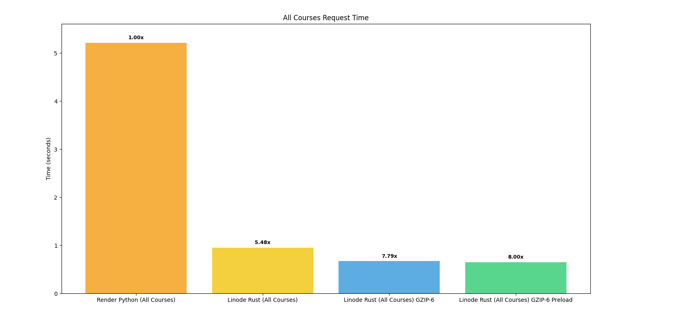

This is a overview of optimizations done to a course search app. We noticed that as our traffic increased and we added more computationally expensive features like vector search, our API got slower. After noticing this, we started running optimization tests and found places for improvements. Here are a few of those improvements.



### Optimization 1.

This first optimization was to write it in Rust (opposed to Python), and the first thing I thought of was to actually load then entire JSON entire a global string to save load time later. We just return the JSON as `RawJson`, so no serialization has to be done [[1](https://api.rocket.rs/master/rocket/response/content/struct.RawJson)]. In future, I would like to separate all of these changes to test them individually like use the `Json` type as a return and see how much different it is than `RawJson`.

This version is also running on a Linode VPS in US West opposed to running on Render.

At a high level, we are loading the file into memory as a string on startup and saving it globally. When the route is hit, we send by the data *as is* in a `RawJson` struct that doesn't do serialization. This is faster than doing serialization with the `Json` struct. Further benchmarks can be done to show how much faster that is.

```rs
static GLOBAL_STRING: OnceCell<String> = OnceCell::new();

#[get("/courses")]
async fn get_all_courses() -> RawJson<String> {
    if let Some(s) = GLOBAL_STRING.get() {
        RawJson(s.to_string())
    } else {
        RawJson(r#"{"message": "Not initialized yet..."}"#.to_string())
    }
}

async fn startup() {
    let json_string: String =
        fs::read_to_string("./all_courses.json").expect("Should have read json file.");

    GLOBAL_STRING.set(json_string).unwrap();
}
```

There are also a few free optimizations with Rust like building with `--release` that give a big speed improvement. I benchmarked this speed improvement in [RedoxQL](https://github.com/JakeRoggenbuck/RedoxQL?tab=readme-ov-file#using-maturin-in-release-mode).

This results in a 5.48x speed up from the Python version.

### Optimization 2.

The next optimization is to use gzip to compress the file before it gets sent. Because it's sending less data, we can expect some amount of time improvement. Furthermore, we can compress the data at startup and save it as a file and just load from a file and return it. I also optimized for the compression ratio compared to speed of compression. I previously found that using `gzip -6` was optimal and thus picked it for this experiment. More experimentation can be done for this specific use case, but I think it's rather optimal and any change won't have significant difference, but that's just speculation and needs to be tested.

At a high level, when the route gets hit, we are loading the gzipped version of our data into memory as a `Vec<u8>`, which is how you can represent bytes in Rust. We then use our Responder to return the bytes as well as setting the Header `Content-Encoding` to `gzip` so the service that fetches this data knows that it needs to be decompressed before it can be used. It's important to test the time it takes to decompress the data as well as the time it takes to send the data, as both impact real world performance.

```rs
struct GzippedJson(Vec<u8>);

#[rocket::async_trait]
impl<'r> Responder<'r, 'static> for GzippedJson {
    fn respond_to(self, _: &'r Request<'_>) -> rocket::response::Result<'static> {
        Response::build()
            .header(ContentType::JSON)
            .header(Header::new("Content-Encoding", "gzip"))
            .sized_body(self.0.len(), Cursor::new(self.0))
            .ok()
    }
}

#[get("/courses-gzip-6")]
async fn get_all_courses_gzip_six() -> Result<GzippedJson, Status> {
    let mut file = File::open("./all_courses.json.6.gz")
        .await
        .map_err(|_| Status::InternalServerError)?;

    let mut contents = Vec::new();
    file.read_to_end(&mut contents)
        .await
        .map_err(|_| Status::InternalServerError)?;

    Ok(GzippedJson(contents))
}
```

This resulted in a 7.79x speedup from the original, but we can do better!

### Optimization 3.

We can use the technique developed in [Optimization 1.](#optimization-1) to preload the file and keep it in memory with a Global OnceCell. This saves us the time of fetching from disk and loading the data into memory.

At a high level, we are loading the gzipped data into memory as bytes at the startup of the server. When the route gets hit, we use our Responder from before to return the data. This loads the gzip at startup and not when the route gets hit.

```rs
static GZIPPED_COURSE_SIX: OnceCell<Vec<u8>> = OnceCell::new();

#[get("/courses-gzip-6-preload")]
async fn get_all_courses_gzip_six_preload() -> Result<GzippedJson, Status> {
    match GZIPPED_COURSE_SIX.get() {
        Some(contents) => Ok(GzippedJson(contents.clone())),
        None => Err(Status::InternalServerError),
    }
}

async fn startup() {
    // -- snip --

    let mut gzip_file = File::open("./all_courses.json.6.gz")
        .await
        .expect("Failed to open gzip-6 file");

    let mut gzip_contents = Vec::new();
    gzip_file
        .read_to_end(&mut gzip_contents)
        .await
        .expect("Failed to read gzip-6 file");

    GZIPPED_COURSE_SIX.set(gzip_contents).unwrap();
}
```

This results in an 8x speed improvement overall.

### Attempt 1.

I tried to improve the speed by not cloning the data, but this didn't have any significant speedup.

```rs
#[get("/courses-gzip-6-preload-own")]
async fn get_all_courses_gzip_six_preload_own() -> Result<GzippedJson, Status> {
    match GZIPPED_COURSE_SIX.get() {
        Some(contents) => Ok(GzippedJson(contents.to_owned())),
        None => Err(Status::InternalServerError),
    }
}
```

This route swaps `contents.clone()` with `contents.to_owned()`, which should cause it speed up because it does not have to copy memory, but copying memory is so quick, it's lost in the noise of the speed tests and is not significant here.

Not all hypothetical optimizations show scientific results.

### Attempt 2.

Using compiler flags can optimize Rust and was effective in [RedoxQL](https://github.com/JakeRoggenbuck/RedoxQL?tab=readme-ov-file#using-rust-compilation-flags) but when the performance of an API has a lot of noise due to sending the data over the wire, the optimizations have to be rather large to show significant and consistent results. I couldn't find any speed improvements with better compiler flags, but there also wasn't any regression.

```toml
[profile.release]
codegen-units = 1
lto = "fat"
opt-level = 3
```

### Conclusion

By changing how you solve a problem, you get get significant speed improvements. We improved the speed of fetching all courses by 8x.
