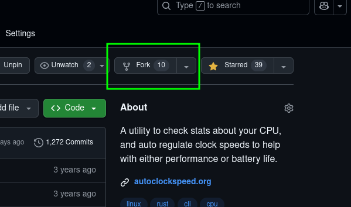


**Early Access!** This post is still in development.


## About this Article

The goal of this article is to help you collaborate with other engineers on software projects. We will cover project setup, working with Git, pushing changes, and general workflow advice.

This is the third edition of "Helpful Git Commands" re-titled as "Using Git Collaboratively". It's become tradition for me to revise this post yearly as I welcome new engineers to product teams. The [original version](../helpful-git-commands/) from April of 2023 was made for the Clubly team and the [second version](../updated-helpful-git-commands/) was made for the general audience of AggieWorks in January of 2024. The second edition included a reference to Circular Development and now the third edition expands upon this topic.

The content of this article has been adapted and improved throughout the years as my experience with Git and onboarding engineers has improved. To date, this information has helped me onboard and teach 18 engineers that have worked on projects I have managed. In addition, I have shared this document with hundreds of students as they start to work collaboratively with others.

## Setting up a project

I require teams to keep a consistent naming convention for their "remotes", as it changed the semantics of commands. For instance, the command `git pull origin main` may mean two different things depending on what origin is set to.

1. Fork the project



2. Clone the fork

```
git clone git@github.com:JakeRoggenbuck/clubly.git
```

3. Add the upstream remote

```
git remote add upstream git@github.com:aggieworks/clubly.git
```

## Checking your Configuration

Check the expected configuration after the project is set up.

```
git remote -v
```

You should noticed four URLs. The `origin` URLs should include your username (e.g. `JakeRoggenbuck`) and the `upstream` URLs should include the name of the organization the project is hosted on.

```
origin	git@github.com:JakeRoggenbuck/clubly.git (fetch)
origin	git@github.com:JakeRoggenbuck/clubly.git (push)
upstream	git@github.com:aggieworks/clubly.git (fetch)
upstream	git@github.com:aggieworks/clubly.git (push)
```

## Getting information from Git

There are a few commands you should frequently use to get information about the state of Git.

#### List Remotes

```sh
git remote -v
```

#### Check your Staging Area

```sh
git status
```

#### View Commits

```sh
git log
```

## Update from latest

To avoid merge conflicts, it's important to pull the latest changes before you start working on a feature.

```sh
# make sure you are on your own main and don't have any current changes
git switch main

git pull upstream main
```

## Before a feature, assignment, or change

Before a new feature, make a feature branch! This should be done before the start of any distinct feature or large change.

```sh
git switch main

git pull upstream main

git switch -c feature-name
```

## Submitting a feature, assignment, or change

Before you can submit a change, you need to "stage" the changed with `git add`.

```sh
# add all changed but previously staged files
git add -u
```

You then need to `commit` the changes with `git commit`. Some like to use `git commit -m "<message>"` but I prefer using `git commit` by itself so I can write a commit message in my editor. This also allows me to add an expanded commentary after the first line. Keep the first line of commit messages to 50 characters. Commit messages are also written in an "imperative" voice by convention.

```sh
git commit
```

Push your feature branch to your remote so that you can then make a pull request.

```sh
git push origin feature-name
```

## How I review

After Pull Requests are created, I read them thoroughly to look for issues. I don't follow any objective metric for what is "Good Enough" but I have written down a standard that illustrates my thinking for when I review code. This guideline is called the [Subjective Test for Pull Request Quality](../../cdn/Subjective-Test-for-Pull-Request-Quality.pdf).

Following review, I run the changed locally as described in [Git for Technical Leadership](../git-for-technical-leadership).

## Circular Development

#### What is Circular Development

Circular Development is a specific set of rules for managing a team's use of Git for collaborative engineering projects. The rules aren't original but the collection of specific practices have shown result for myself and teams that I manage. It's hard to communicate this specific set of rules, so I created a term to represent these ideas. Thinking follows language, and I've noticed my thinking is more clear when using a term for these rules. Having a name for this practice also allows me to communicate it more clearly.


A testimonial for Circular Development came from a technical manager I had shared this with after his team was plagued with merge conflicts and faulty builds. I drew this diagram on the board and helped his team set up forks for each of their members. I explained what I look for when reviewing and let them figure out what this practice looked like for their team.

After checking back 2 quarters later, the manager said that Circular Development had reduced the latency of integrating new feature to 1 hour down from 24 hours of work (a 95% reduction in time). Following this, we saw their succesful launch to the App Store.

## Definitions and Other Notes

#### Expanded Commit Message

In Git, the first line should be 50 characters only. That's enough for most commit messages. If you need to add more details, you need to include an empty line and then you get as many lines after that to explain extra details.

**Example of multi-line commit message:**

```
Fix scroll bar on about page

The about page had the old version of the scroll bar and I had to move over
the scroll bar from the home section. In the future, this should be a shared
component for both.
```

**Including Results or Notes:**

Here is an example where I included a particularly long commit. This isn't advisably most of the time, as Git commit messages should not be content themselves, but sometimes it is helpful to keep a record of WHEN a result might have changed.

```
commit bc4e04c1f329cc46b6c7848b576a44a2261220b0
Author: Jake Roggenbuck <35516367+JakeRoggenbuck@users.noreply.github.com>
Date:   Tue Feb 18 12:25:22 2025 -0800

    real    0m0.117s
    user    0m0.106s
    sys     0m0.010s
    (venv) redoxql (main) λ time p exam_tester_m1.py
    Insert finished

    real    0m0.282s
    user    0m0.272s
    sys     0m0.010s
    (venv) redoxql (main) λ

    Compared to without:

    (venv) redoxql (main) λ p __main__.py
    Inserting 10k records took:                      0.007401888000000002
    Updating 10k records took:                       0.018957811999999997
    Selecting 10k records took:                      0.015054888999999995
    Aggregate 10k of 100 record batch took:  0.003300163000000002
    Deleting 10k records took:                       0.002181812999999991
    (venv) redoxql (main) λ time p m1_tester.py
    Insert finished

    real    0m0.112s
    user    0m0.108s
    sys     0m0.004s
    (venv) redoxql (main) λ time p exam_tester_m1.py
    Insert finished

    real    0m0.268s
    user    0m0.254s
    sys     0m0.014s
```
