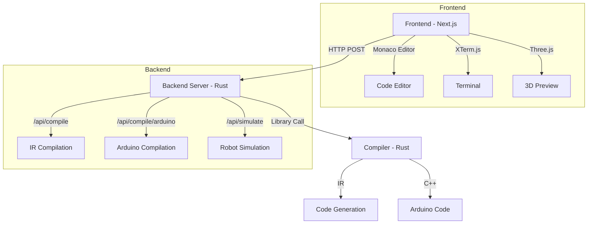

---
title: hackdavis-2025
type: page
date: 2025-04-19T00:00:00
tags: ["TypeScript"]
description: "None"
---


# 🚀 Assemblr - HackDavis 2025


<div align="center">


**A revolutionary web-based IDE with a custom assembly-like language for robotics programming!**

[](https://hackdavis.io)
[](https://nextjs.org)
[](https://www.rust-lang.org)
[](https://www.typescriptlang.org)
[](https://tailwindcss.com)

</div>

## 🌟 Overview

Assemblr is a cutting-edge development environment that combines the power of modern web technologies with a custom-built compiler for robotics programming. Whether you're a robotics enthusiast, student, or professional developer, our platform provides an intuitive interface for writing and executing robot control code.

### Key Features
- 🎯 **Real-time Compilation**: Instant feedback on your code
- 🔄 **Live Preview**: See your robot's movements in a simulated environment
- 📝 **Intelligent Code Editor**: Syntax highlighting and autocompletion
- 🧪 **Debugging Tools**: Step-through execution and variable inspection
- 📱 **Responsive Design**: Works seamlessly on desktop and mobile
- 🌐 **Cloud Integration**: Save and share your projects

## 💡 Pro Tips & Tricks

### Code Organization
- Use meaningful labels and variable names
- Group related code into functions
- Add comments to explain complex logic
- Keep functions small and focused

### Performance Optimization
- Use variables for repeated values
- Minimize wait times between movements
- Optimize movement patterns
- Use loops for repetitive actions

### Debugging Techniques
- Add strategic `mov wait` commands to slow down execution
- Use variables to track state
- Print debug information to the terminal
- Test functions in isolation

## 📊 Architecture



## 🛠️ Tech Stack

### Frontend Powerhouse
- ⚛️ **Next.js 15** - React framework for production
- 📝 **TypeScript** - Type-safe development
- 🎨 **Tailwind CSS** - Utility-first styling
- 📊 **Monaco Editor** - VS Code-like editing experience
- 🖥️ **XTerm.js** - Terminal emulation
- 🎯 **React Icons** - Beautiful iconography
- 🎮 **Three.js** - 3D robot visualization
- 📱 **Responsive Design** - Mobile-first approach

### Robust Backend
- 🦀 **Rust** - Systems programming language
- 🔧 **Custom Compiler** - Purpose-built for robotics
- 🌐 **Unicode Support** - International character compatibility
- 📦 **Module System** - Organized code structure
- 🔄 **Async Runtime** - High-performance concurrency
- 🧪 **Unit Testing** - Comprehensive test coverage

## 📡 API Documentation

### Compilation Endpoints

#### 1. Compile to IR
```http
POST /api/compile
Content-Type: application/json

{
    "code": "your assembly code here",
    "options": {
        "optimize": true,
        "debug": false
    }
}
```

**Response:**
```json
{
    "output": {
        "ir": "compiled IR in JSON format",
        "metadata": {
            "executionTime": "0.123s",
            "optimizationLevel": "high",
            "warnings": []
        }
    }
}
```

**Error Response:**
```json
{
    "error": {
        "message": "error message",
        "line": 42,
        "column": 10,
        "suggestion": "Did you mean 'forward' instead of 'foward'?"
    }
}
```

#### 2. Compile to Arduino
```http
POST /api/compile/arduino
Content-Type: application/json

{
    "code": "your assembly code here",
    "board": "arduino_uno",
    "options": {
        "includeLibraries": ["Servo.h", "Wire.h"]
    }
}
```

**Response:**
```json
{
    "output": {
        "code": "generated Arduino C++ code",
        "dependencies": ["Servo.h", "Wire.h"],
        "memoryUsage": {
            "flash": "1234 bytes",
            "sram": "567 bytes"
        }
    }
}
```

### Assembly Language Syntax

#### Basic Syntax
```assembly
# Comments start with #
# Labels end with :
# Instructions are lowercase
# Values can be decimal or hex (0x prefix)

# Example program - Simple Square Movement
square:
    mov forward, 10     # Move forward 10 units
    mov direction, 1    # Turn left 90 degrees
    mov forward, 10     # Move forward 10 units
    mov direction, 1    # Turn left 90 degrees
    mov forward, 10     # Move forward 10 units
    mov direction, 1    # Turn left 90 degrees
    mov forward, 10     # Move forward 10 units
    ret                # Return to caller

main:
    jal square         # Execute square movement
    mov wait, 1        # Wait 1 second
    jal square         # Repeat square movement
```

#### Advanced Features
```assembly
# Example: Complex Pattern with Variables and Loops
var speed = 5
var pattern_size = 4
var angle = 45

# Function to draw a pattern
draw_pattern:
    param size
    param angle
    var i = 0
    
    pattern_loop:
        mov forward, size
        mov direction, angle
        add i, 1
        blt i, pattern_size, pattern_loop
    ret

main:
    mov speed, speed           # Set movement speed
    jal draw_pattern           # Draw first pattern
    mov wait, 0.5             # Pause
    mov direction, 180        # Turn around
    jal draw_pattern           # Draw second pattern
```

#### More Examples

##### 1. Spiral Pattern
```assembly
# Draw a spiral pattern
spiral:
    var radius = 1
    var angle = 0
    
    spiral_loop:
        mov forward, radius
        mov direction, 1
        add radius, 1
        add angle, 1
        blt angle, 36, spiral_loop
    ret

main:
    jal spiral
```

##### 2. Obstacle Avoidance
```assembly
# Simple obstacle avoidance routine
avoid_obstacle:
    mov backward, 5           # Back up
    mov direction, 1          # Turn left
    mov forward, 10           # Move forward
    mov direction, 2          # Turn right
    mov forward, 10           # Move forward
    ret

main:
    var obstacle_detected = 0
    
    loop:
        mov forward, 1
        # Simulate obstacle detection
        add obstacle_detected, 1
        beq obstacle_detected, 5, avoid
        j loop
    
    avoid:
        jal avoid_obstacle
        mov obstacle_detected, 0
        j loop
```

##### 3. Zigzag Pattern
```assembly
# Create a zigzag pattern
zigzag:
    var steps = 5
    var i = 0
    
    zigzag_loop:
        mov forward, 10
        mov direction, 1
        mov forward, 10
        mov direction, 2
        add i, 1
        blt i, steps, zigzag_loop
    ret

main:
    jal zigzag
```

### Available Commands

| Command | Description | Example | Notes |
|---------|-------------|---------|-------|
| `mov direction, N` | Set movement direction | `mov direction, 1` | 0=straight, 1=left, 2=right |
| `mov forward, N` | Move forward N units | `mov forward, 4` | Units are in centimeters |
| `mov backward, N` | Move backward N units | `mov backward, 2` | Negative values not allowed |
| `mov wait, N` | Wait N seconds | `mov wait, 1` | Supports decimal values |
| `jal label` | Jump to label | `jal circle` | Supports nested calls |
| `ret` | Return from subroutine | `ret` | Must be in function |
| `var name = value` | Declare variable | `var speed = 5` | Global scope |
| `param name` | Function parameter | `param distance` | Must be in function |
| `add var, value` | Add to variable | `add counter, 1` | Supports variables |
| `sub var, value` | Subtract from variable | `sub counter, 1` | Supports variables |
| `blt var, value, label` | Branch if less than | `blt i, 10, loop` | Supports variables |
| `beq var, value, label` | Branch if equal | `beq x, 0, end` | Supports variables |
| `j label` | Unconditional jump | `j loop` | Direct jump |
| `print var` | Print variable value | `print counter` | Debugging tool |

## 🚀 Getting Started

### Prerequisites
- Node.js 18+
- Rust and Cargo
- Git
- Arduino IDE (optional, for hardware deployment)

### Quick Start

1. **Clone & Install**
   ```bash
   git clone https://github.com/yourusername/hackdavis-2025.git
   cd hackdavis-2025
   ```

2. **Frontend Setup**
   ```bash
   cd client
   npm install
   npm run dev
   ```

3. **Backend Setup**
   ```bash
   cd server
   cargo run
   ```

4. **Compiler Setup**
   ```bash
   cd compiler
   cargo build
   cargo test
   ```

### Development Workflow

1. **Writing Code**
   - Open the IDE in your browser (default: http://localhost:3000)
   - Write your robot control code in the editor
   - Use the live preview to see the robot's movements

2. **Testing**
   - Run unit tests: `cargo test`
   - Check compiler output: `cargo run -- compile examples/robot.asm`
   - Test Arduino output: `cargo run -- compile-arduino examples/robot.asm`

3. **Deployment**
   - Build production version: `npm run build`
   - Deploy to server: `cargo build --release`
   - Upload to Arduino: Use the generated .ino file

## 📁 Project Structure

```
hackdavis-2025/
├── client/                  # Frontend application
│   ├── app/                # Next.js app directory
│   │   ├── components/     # React components
│   │   │   ├── Editor/    # Code editor component
│   │   │   ├── Preview/   # 3D preview component
│   │   │   └── Terminal/  # Terminal component
│   │   ├── lib/           # Utility functions
│   │   ├── page.tsx       # Main page
│   │   └── globals.css    # Global styles
│   └── package.json       # Frontend dependencies
│
├── server/                 # HTTP backend
│   ├── src/               # Server source
│   │   ├── main.rs       # API endpoints
│   │   ├── routes/       # Route handlers
│   │   └── models/       # Data models
│   └── Cargo.toml        # Server dependencies
│
├── compiler/              # Rust compiler backend
│   ├── src/              # Source code
│   │   ├── lexer.rs     # Token analysis
│   │   ├── parser.rs    # AST generation
│   │   ├── codegen.rs   # Code generation
│   │   └── lib.rs       # Core functionality
│   ├── tests/           # Test cases
│   └── Cargo.toml       # Rust dependencies
│
└── README.md             # Project documentation
```

## 🧪 Testing

### Frontend Tests
```bash
cd client
npm test
```

### Backend Tests
```bash
cd server
cargo test
```

### Compiler Tests
```bash
cd compiler
cargo test
```

## 🤝 Contributing

We welcome contributions! Here's how you can help:

1. Fork the repository
2. Create your feature branch (`git checkout -b feature/AmazingFeature`)
3. Commit your changes (`git commit -m 'Add some AmazingFeature'`)
4. Push to the branch (`git push origin feature/AmazingFeature`)
5. Open a Pull Request

### Development Guidelines
- Follow the Rust style guide for backend code
- Use TypeScript for all frontend code
- Write tests for new features
- Update documentation as needed
- Keep commits focused and atomic

## 📝 License

This project is licensed under the MIT License - see the [LICENSE](LICENSE) file for details.

## 🙏 Acknowledgments

- HackDavis 2025 organizers and mentors
- The amazing Next.js and Rust communities
- All contributors and supporters
- The open-source community for their invaluable tools and libraries

---

<div align="center">

**Built with ❤️ at HackDavis 2025**

[Report Bug](https://github.com/yourusername/hackdavis-2025/issues) · [Request Feature](https://github.com/yourusername/hackdavis-2025/issues)

</div>
